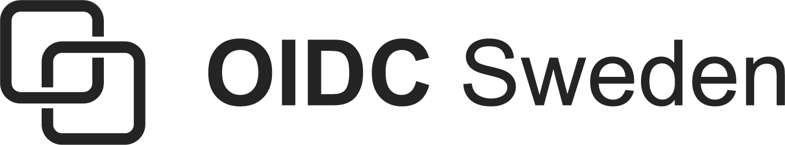

# Swedish OpenID Connect Profile Specifications

The oidc-sweden/specifications repository is where the Working Group for the Swedish OpenID Connect Profile develops the specifications for the Swedish OpenID Connect Profile.

* [The Swedish OpenID Connect Profile 1.0 - draft](swedish-oidc-profile.md) - The main specification for the Swedish OpenID Connect profile.

* [Attribute Specification for the Swedish OAuth2 and OpenID Connect Profiles 1.0 - draft](swedish-oidc-attribute-specification.md) - Claims and scopes.

* [Signature Extension for OpenID Connect 1.0 - draft](oidc-signature-extension.md) - A signature extension for OpenID Connect.

