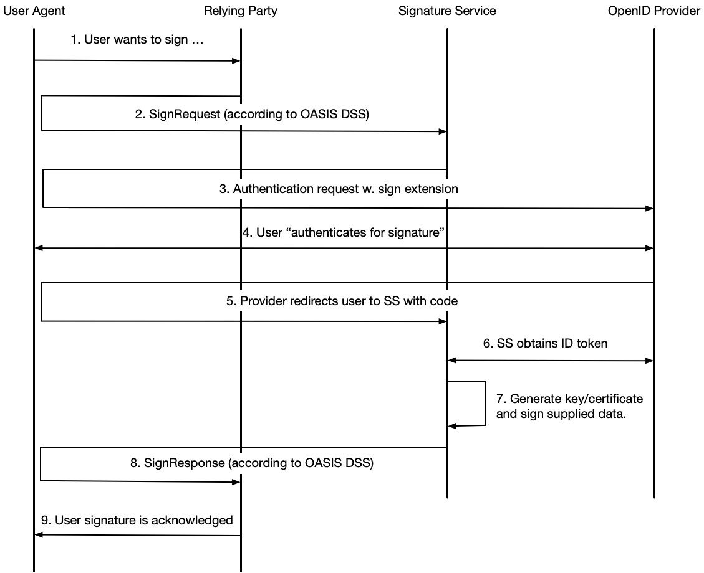

# Signature Extension for OpenID Connect

### Version: 1.0 - draft 01 - 2021-04-20

## Abstract

This specification defines an extension to OpenID Connect to facilitate the use cases where a Relying Party sends a "Signature Request" to an OpenID Provider. A signature request is an extension of an OpenID Connect authentication request where a SignatureRequest object is passed as a request parameter or a Request Object.


## Table of Contents

1. [**Introduction**](#introduction)

    1.1. [Requirements Notation and Conventions](#requirements-notation-and-conventions)
    
2. [**Signature Models**](#signature-models)
    
    2.1. [Delegated Signing](#delegated-signing)
    
    2.2. [Federated Signing](#federated-signing)
    
3. [**Claims and Scopes**](#claims-and-scopes)

    3.1. [Signature Result Claims](#signature-result-claims)
    
    3.1.1. [Signature Activation Data](#signature-activation-data)
    
    3.1.2. [Sign Message Digest](#sign-message-digest)
    
    3.2. [The Signature Request Parameter Claim](#the-signature-request-parameter-claim)
    
    3.2.1. [Placement of the Parameter in an Authentication Request](#placement-of-the-parameter-in-an-authentication-request)
    
    3.2.2. [Security Requirements](#security-requirements)
    
    3.3. [Signature Scopes](#signature-scopes)
    
    3.3.1. [Delegated Signing](#delegated-signing)
    
    3.3.2. [Federated Signing](#federated-signing)

4. [**Relying Party Requirements**](#relying-party-requirements)

    4.1. [Requests](#requests)
    
    4.1.1. [Requirements on Signing User](#requirements-on-signing-user)
    
    4.1.2. [Signature Service Requirements](#signature-service-requirements)

5. [**OpenID Provider Requirements**](#openid-provider-requirements)

    5.1. [Support for Signature Models](#support-for-signature-models)
    
    5.2. [Processing Requirements](#processing-requirements)
    
    5.3. [User Interface Requirements](#user-interface-requirements)
    
    5.4. [Discovery](#discovery)
    
6. [**Examples**](#examples)

7. [**Normative References**](#normative-references)

---

<a name="introduction"></a>
## 1. Introduction

This specification defines an extension to OpenID Connect to facilitate that a user digitally signs data provided by a Relying Party at the OpenID Provider.

<a name="requirements-notation-and-conventions"></a>
### 1.1. Requirements Notation and Conventions

The key words “MUST”, “MUST NOT”, “REQUIRED”, “SHALL”, “SHALL NOT”, “SHOULD”, “SHOULD NOT”, “RECOMMENDED”, “MAY”, and “OPTIONAL” are to be interpreted as described in \[[RFC2119](#rfc2119)\].

These keywords are capitalized when used to unambiguously specify requirements over protocol features and behavior that affect the interoperability and security of implementations. When these words are not capitalized, they are meant in their natural-language sense.

<a name="signature-models"></a>
## 2. Signature Models

This specification supports two types of signature models, or use cases; *Delegated Signing* and *Federated Signing*. 

As we will see, an OpenID Provider that supports the Delegated Signing model will automatically also support the Federated Signing model, but an OpenID Provider that supports the Federated Signing model does not necessarily support the Delegated Signing model.

<a name="delegated-signing"></a>
#### 2.1. Delegated Signing

For the delegated signing model the Relying Party delegates the signing operation to the OpenID Provider by sending an authentication request with a sign extension. The flow below illustrates each step in for the delegated signing model.


1. The user wants to sign something at the Relying Party, for example a form, and clicks "Sign".

2. The Relying Party (client) initiates an "authentication for signature" by redirecting the user to the OpenID Provider along with an authentication request containing a sign extension (see chapter XX below).

3. During the "authentication for signature" the user actually performs a signature of the "to-be-signed" data that was supplied as an extension to the authentication request. In this step the OpenID Provider also displays a summary of what is being signed.

4. After a completed signature operation the user agent is redirected back to the client along with an authorization code.

5. Next, the client obtains an ID token that contains information about the signee along with the signed data.

6. Finally, the completed signature operation is acknowledged to the user.

The advantage with this use case is that it is simple and straightforward. The disadvantage is that only OpenID Providers that actually supports eID:s that support creating signatures can be used.


<a name="federated-signing"></a>
#### 2.2. Federated Signing

The federated signature model is defined within the [Swedish eID Framework](https://docs.swedenconnect.se/technical-framework) and comprises an additional role, the Signature Service.

A Signature Service is a stand-alone service that exposes a signature API to its relying parties. Within the Swedish eID Framework this API is an extension to OASIS Digital Signature Service (\[[SC.DssExt](#sc-dssext)\]). The Signature Service generates a private key and a certificate on behalf of the user and signs the data with this key. Before this is done the Signature Service needs to authenticate the user and obtain his or hers approval to sign. This is done by sending an authentication request to an Identity Provider (in this specification an OpenID Provider).

One advantage of this model is that the actual signature is created at the Signature Service which means that the actual eID being used does not have to be PKI-based, and/or, have the capability to sign. Another advantage is that signatures can be created according to a format decided by the Relying Party, independently of what is supported by any OpenID Providers used by the Relying Party.

One obvious drawback with this model is that is more complex than the delegated signing model. 

The flow below illustrates each step in this use case.



1. The user wants to sign something at the Relying Party, for example a form, and clicks "Sign".

2. The Relying Party (client) now compiles a SignRequest message and includes this when it posts the user agent to the Signature Service. This SignRequest message is according to \[[SC.DssExt](#sc-dssext)\] and contains one, or several, digests of the data to be signed along with elements such as required signature format, required user attributes, which identity provider to use, and much more.

3. Before the Signature Service can proceed it needs to authenticate the user, and obtain his or hers approval to sign the data. So the Signature Service, that is now an OIDC client, initiates an "authentication for signature" by redirecting the user to the OpenID Provider along with an authentication request containing a sign extension (see chapter XX below).

4. The user now authenticates. During this process the OpenID Provider displays a summary of what is to be signed (the sign message). Note that depending on whether the OpenID Provider has signing capabilities or not, the user may actually perform a signature at this stage (see XXX below).

5. After a completed "authentication for signature" operation the user agent is redirected back to the Signature Service along with an authorization code.

6. Next, the Signature Service obtains an ID token that contains information about the user along with a user consent for signature.

7. Now the Signature Service generates a key pair, and signs the data received from the Relying Party (step 2).

8. A SignResponse message according to \[[SC.DssExt](#sc-dssext)\] is now created and posted back to the Relying Party.

9. Finally, the completed signature operation is acknowledged to the user.

<a name="claims-and-scopes"></a>
## 3. Claims and Scopes

This section extends \[[AttrSpec](#attr-spec)\] with definitions of claims and scopes used for the signing use cases defined in this specification.

<a name="signature-result-claims"></a>
### 3.1. Signature Result Claims

The most obvious claim to use in an ID token after a signature operation, `https://claims.oidc.se/1.0/userSignature`, is defined in section 2.3.2 of \[[AttrSpec](#attr-spec)\]. This section defines additional claims for signature operation results.

<a name="signature-activation-data"></a>
#### 3.1.1. Signature Activation Data

**Claim:** `https://claims.oidc.se/1.0/sad`

**Description:** The sad attribute holds Signature Activation Data that is required by a signature service in order to service a signature request in accordance with CEN EN 419 241-2. See further the "Signature Activation Protocol for Federated Signing", \[[SC.SAP](#sc-sap)\], specification.

**Type:** String (Base64 encoded)

> Note: For the federated signing model only.

<a name="sign-message-digest"></a>
#### 3.1.2. Sign Message Digest

**Claim:** `https://claims.oidc.se/1.0/signMessageDigest`

**Description:** The signMessageDigest claim is delivered as a proof that an identity provider displayed a sign message for the user and that the user actively confirmed acceptance of this sign message. See section 3.2.4 of \[[SC.AttrSpec](#sc-attrspec)\] for details.

**Type:** String (according to section 3.2.4 of \[[SC.AttrSpec](#sc-attrspec)\])

> Note: For the federated signing model only.

<a name="the-signature-request-parameter-claim"></a>
### 3.2. The Signature Request Parameter Claim

**Parameter:** `https://claims.oidc.se/1.0/signRequest`

**Description:** The signature request parameter claim is included in an authentication request to request delegated or federated signing, and to provide the input data for this signature operation.

**Value type:** The value for the signature request parameter claim is a JSON object<sup>1</sup> with the following fields:

- `tbs_data` - The data to be signed as a Base64-encoded string. This specification does not specify the format on the supplied data. It is regulated by the signature scheme being used. For the delegated signature model this field is mandatory.

- `sign_message` - A sign message is the human readable text snippet that is displayed to the user as part of the signature process. This object is mandatory for both signing models and consists of the following fields:

    - `mime_type` - The MIME type of the supplied message. Possible values are `text/plain` (where `;charset=UTF-8` is an implicit condition) and `text/markdown`<sup>2</sup>. If no value is given for this field, `text/plain` MUST be assumed.
    
    - `message` - A Base64-encoding of the UTF-8 string holding the sign message to display to the user. The `message` field MUST be present in a `sign_message` object.
    
    - `require_consent` - A boolean telling whether the issuer of the request requires that the provider displays the supplied sign message to the user, and gets his or hers approval for the operation<sup>3</sup>. If the field is not present a value of `true` MUST be assumed.

> \[1\]: Depending on where in a request the parameter is placed, the value may be a JWT, see [section 3.2.1](#placement-of-the-parameter-in-an-authentication-request) below. 

> \[2\]: The Markdown dialect, and potential restrictions for tags, are not regulated in this specification.

> \[3\]: In other words; the requirement is that the user actually sees the sign message and understands that he or she is performing a signature operation.

**Example:**

```
...
"https://claims.oidc.se/1.0/signRequest" : {
  "tbs_data" : "<Base64-encoded data>",
  "sign_message" : {
    "mime_type" : "text/plain",
    "message" : "<Base64-encoding of UTF-8 string holding the sign message>",
    "require_consent" : true
  }
},
...
```

<a name="placement-of-the-parameter-in-an-authentication-request"></a>
#### 3.2.1. Placement of the Parameter in an Authentication Request

The signature request parameter claim (`https://claims.oidc.se/1.0/signRequest`), can be provided in an authentication request in two ways; as a custom request parameter where its value is represented as a JWT, or as part of a Request Object that is the value to the `request` (or `request_uri`) parameter.

<a name="as-a-custom-request-parameter"></a>
##### 3.2.1.1. As a Custom Request Parameter

If the sign request parameter claim is included as a custom request parameter its value MUST be represented as a JWT following the security requirements specified in [section 3.2.2](#security-requirements) below.

Below follows a minimal, and non-normative, example redirect response by the client, which triggers the user agent to make an authentication request to the authorization endpoint: 

```
HTTP/1.1 302 Found
Location: https://server.example.com/authorize?
  response_type=code
  &scope=openid%20https%3A%2F%2Fscopes.oidc.se%2F1.0%2FdelegatedSign
  &client_id=exampleclientid
  &state=af0ifjsldkj
  &redirect_uri=https%3A%2F%2Fclient.example.org%2Fcb
  &https%3A%2F%2Fclaims.oidc.se%2F1.0%2FsignRequest=eyJhbjIn0.ew0...MbpL-2QgwUsAlMGzw
```

The scopes requested are `openid` (always) and `https://scopes.oidc.se/1.0/delegatedSign` that instructs the OpenID Provider that this is a signature request. In a real-life scenario the Relying Party would probably request additional claims using more scopes, for example, `https://scopes.oidc.se/1.0/naturalPersonPnr` and `https://scopes.oidc.se/1.0/authnInfo` (see \[[AttrSpec](#attr-spec)\]).

The parameter `https://claims.oidc.se/1.0/signRequest` is among the parameters and its value is a JWT (abbreviated for readability). This parameter value holds the input to the signature operation.

<a name="placed-in-a-request-object"></a>
##### 3.2.1.2. Placed in a Request Object

The signature request parameter and value can also be part of a Request Object JWT that is the value for the `request` (or `request_uri`) parameter. 

Since the Request Object is a JWT, the value for the signature request parameter is in these cases an JSON object (see [section 3.2](#the-signature-request-parameter-claim)).

See section 6, "Passing Request Parameters as JWTs", in \[[OpenID.Core](#openid-core)\] for details. 

**Note:** It is perfectly legal to create a request where some parameters are assigned as regular request parameters and some are included in the Request Object. However, if the Request Object is signed the `iss` (issuer) and `aud` (audience) claims MUST be included in the Request Object. 

The following is a non-normative example of the claims in a Request Object before Base64, URL-encoding (and signing): 

```
{
  "iss": "exampleclientid",
  "aud": "https://server.example.com",
  "response_type": "code",
  "redirect_uri": "https://client.example.org/cb",
  "scope": "openid https://scopes.oidc.se/1.0/delegatedSign",
  "https://claims.oidc.se/1.0/signRequest": {
    "tbs_data" : "VGhpcyBpcyB0aGUgZGF0YSB0aGF0IEkgd2FudCB0byBzaWdu",
    "sign_message" : {
      "mime_type" : "text/plain",
      "message" : "VGhpcyBpcyB0ZXh0IGRpc3BsYXllZCBmb3IgdGhlIHVzZXI=",
      "require_consent" : true
    }
  }
}

```

When the client creates a redirect response, which triggers the user agent to make an authentication request to the authorization endpoint it looks like:

```
https://server.example.com/authorize?
  response_type=code
  &client_id=exampleclientid
  &redirect_uri=https%3A%2F%2Fclient.example.org%2Fcb
  &scope=openid%20https%3A%2F%2Fscopes.oidc.se%2F1.0%2FdelegatedSign
  &state=af0ifjsldkj
  &nonce=n-0S6_WzA2Mj
  &request=eyJhbGciOiJSUzI1NiIsImtpZCI6ImsyYmRjIn0.ew0KICJpc3MiOiA
    iczZCaGRSa3...xMbpL-2QgwUsAlMGzw
```

The example illustrates how a Request Object is passed by value. See section 6.2, "Passing a Request Object by Reference", in \[[OpenID.Core](#openid-core)\] for how to use the `request_uri` instead.

<a name="security-requirements"></a>
#### 3.2.2. Security Requirements

The contents of the `https://claims.oidc.se/1.0/signRequest` claim contain the data to be signed, and it is essential that no party can alter this while the request message is in transit. Therefore, the following security requirements apply for Relying Parties and OpenID Providers that are compliant with this specification:

If the signature request claim is included as a custom request parameter (see [3.2.1.1](#as-a-custom-request-parameter) above), its value represented as a JWT MUST be signed by the client's registered key, and MAY be encrypted to the recipient's registered public key.

If the signature request claim is part of a Request Object according to section [3.2.1.2](#placed-in-a-request-object) above, the entire Request Object JWT MUST be signed by the client's registered key, and MAY be encrypted to the recipient's registered public key. 

<a name="signature-scopes"></a>
### 3.3. Signature Scopes

This section defines two scopes that represent the signature models described in [chapter 2](#signature-models). The scopes are used when a client sends an authentication request that is a request for signature. 

The scopes defined below only declare signature specific claims. A client requesting signature typically also includes other scopes/claims in the authentication request (for release of user identity information, and possibly also for extended authentication information). 

<a name="delegated-signing"></a>
#### 3.3.1. Delegated Signing

**Scope:** `https://scopes.oidc.se/1.0/delegatedSign`

**Description:** This scope services two purposes; it indicates for the OpenID Provider that the current authentication request is a request for delegated signing, and, it requests the claims declared below.

| Claim | Description/comment | Requirement |
| :--- | :--- | :--- |
| `https://claims.oidc.se/`<br />`1.0/userSignature` | The resulting user signature. | Mandatory |

<a name="federated-signing"></a>
#### 3.3.2. Federated Signing

**Scope:** `https://scopes.oidc.se/1.0/federatedSign`

**Description:** This scope services two purposes; it indicates for the OpenID Provider that the current authentication request is a request for "authentication for signature", and, it requests the claims declared below.

| Claim | Description/comment | Requirement |
| :--- | :--- | :--- |
| `https://claims.oidc.se/`<br />`1.0/userSignature` | The user signature. For federated signing a user signature MAY be created if the identity provider supports signing. | Optional |
| `https://claims.oidc.se/`<br />`1.0/signMessageDigest` | A digest of the sign message that was sent by the client in the request. This claim MUST be included iff the client included a sign message in the request and this message was display for, and approved by, the user.  | Optional |
| `https://claims.oidc.se/1.0/sad` | Signature activation data.<br />*TODO: More will be written about the conditions of including the sad claim.* | Optional |

<a name="relying-party-requirements"></a>
## 4. Relying Party Requirements

<a name="requests"></a>
### 4.1. Requests

TODO: Refer to iGov, or our own main profile regarding requirements for request parameters.

A Relying Party wishing to issue a request for signature MUST include either the `https://scopes.oidc.se/1.0/delegatedSign` scope or the `https://scopes.oidc.se/1.0/federatedSign` scope along with the mandatory `openid` scope as values to the `scope` request parameter. It MUST NOT include both signing scopes.

A request for signature MUST contain the [Signature Request Parameter Claim](#the-signature-request parameter-claim) and its inclusion in the request MUST follow the requirements stated in sections [3.2.1](#placement-of-the-parameter-in-an-authentication-request), "[Placement of the Parameter in an Authentication Request](#placement-of-the-parameter-in-an-authentication-request)" and [3.2.2](#security-requirements), "[Security Requirements](#security-requirements)".

The authentication request MUST contain the `prompt` parameter<sup>1</sup> and its value MUST be include the `login` parameter value.  The reason for this is that a signature must never be generated based on a previous authentication.

> \[1\]: The `prompt` parameter can be provided either as an ordinary request parameter or as a field in a Request Object.

<a name="requirements-on-signing-user"></a>
#### 4.1.1. Requirements on Signing User

In most cases a user is already logged into the service that wants the user to sign some date, for example an approval or a document. The data that is to be signed can be sensitive, and the service will need to ensure that only the intended user can view this data.  

TODO: Describe how to use the claims parameter to include information about the user that is to sign the data, for example, give the personal identity number. See chapter 5.5.1 of \[[OpenID.Core](#openid-core)\].

Request Object example of how we request that the signature is for the given user having the personal identity number (URL-encoding not applied for readability reasons): 

```
{
  ...
  "claims" : {
    "id_token" : {
      "https://claims.oidc.se/1.0/personalNumber" : {
        { "essential" : true },
        { "value" : "196903261687" }
      }
    }
  },
} 
```

<a name="signature-service-requirements"></a>
#### 4.1.2. Signature Service Requirements

A Signature Service, that is, the stand-alone service exposing a signature API to its relying parties (see section [2.2](#federated-signing), "[Federated Signing](#federated-signing)"), is a client to an OpenID Provider during the phase when the Signature Service needs to "authenticate the user for signing". This section specifies requirements that apply only for such Signature Services, and not a generic Relying Party that wants to use the delegated signing model.

It is RECOMMENDED that a Signature Service queries the discovery document/metadata of an OpenID Provider in order to obtain whether it supports the delegated and/or federated signing model. If no metadata is available the information stated in [section 5.X](#discovery) below MUST be provided to the Signature Service by other means.

A Signature Service SHOULD always prefer to use the `https://scopes.oidc.se/1.0/delegatedSign` scope if this is supported by the OpenID Provider. This ensures that the user actually performs a signature operation, and not only "authenticates for signature", and this gives a better user experience and understanding in most cases. 

For the delegated signing model the `tbs_data` field of the signature request parameter object ([3.2](#the-signature-request-parameter-claim)) MUST be set, and since the actual signature in the federated signing model is generated by the Signature Service (according to \[[SC.DssExt](#sc-dssext)\]) the Signature Service needs to supply some other data element to sign.

This specification does not put any restrictions on the data assigned to `tbs_data` in these cases other than that it MUST be bound to the DSS SignRequest message that the Signature Service is processing.     

A Signature Service that processes a DSS SignRequest message that does not contain a `<SignMessage>` element MUST generate a suitable sign message to be included in the `sign_message` object of the signature request parameter object ([3.2](#the-signature-request-parameter-claim)). Typically something like "Organization XX has requested your signature" is a good choice.

> Note: There is nothing that prevents a Signature Service from making use of an OpenID Provider that does not comply with this specification and has no knowledge of the [signature request parameter claim](#the-signature-request-parameter-claim). However, in these cases the OpenID provider will perform an ordinary authentication, and the user needs to be informed by the signature relying party about what is happening.  

<a name="openid-provider-requirements"></a>
## 5. OpenID Provider Requirements

<a name="support-for-signature-models"></a>
### 5.1. Support for Signature Models

An OpenID provider that supports the [delegated signing model](#delegated-signing), i.e., supports an eID that has signing capabilities, MUST also declare support for the [federated signing model](#federated-signing). 

These OpenID providers can process signature requests exactly the same, independently of the requested signature model<sup>1</sup>. The only thing that differs is that when `https://scopes.oidc.se/1.0/federatedSign` scope is included, the `https://claims.oidc.se/1.0/signMessageDigest` claim MUST be included in the resulting ID token if a signature message was displayed to the user.

<a name="processing-requirements"></a>
### 5.2. Processing Requirements

This section defines requirements that apply to OpenID Providers that process requests for signature.

An OpenID Provider receiving a request containing both the `https://scopes.oidc.se/1.0/delegatedSign` and the `https://scopes.oidc.se/1.0/federatedSign` scope MUST be respond with an error.

An OpenID Provider that receives a request for signature MUST authenticate the user, even if the user has a previous authentication session at the OpenID Provider.

TODO: 

- Only release signature result claims in the ID token - never from the UserInfo endpoint.

- MUST verify signature on JWT holding the signature request.

- MUST support encrypted JWTs.

- MUST support the `claims` request parameter and make checks that what is received there matches the identity of the subject that performed the signature. 

<a name="user-interface-requirements"></a>
### 5.3. User Interface Requirements

The requirements listed in this section concerns the user interface presented to the user during a signature operation. When we refer to the OpenID Provider user interface we also include any devices and apps that are involved in the signature operation.

An OpenID Provider supporting signing according to this specification MUST indicate to the user that a signature is being performed (as opposed to an authentication).

TODO: more

<a name="discovery"></a>
### 5.4. Discovery

OpenID Providers that supports the OpenID Connect Discovery standard, \[[OpenID.Discovery](#openid-discovery)\] and are compliant with this specification, MUST meet the following requirements:

The `scopes_supported` MUST be present in the provider's discovery document and it MUST contain at least one of the scopes `https://scopes.oidc.se/1.0/delegatedSign` and `https://scopes.oidc.se/1.0/federatedSign`.

An OpenID provider that declares the `https://scopes.oidc.se/1.0/delegatedSign` scope MUST also declare the `https://scopes.oidc.se/1.0/federatedSign` scope.

Also, it is RECOMMENDED that the `https://scopes.oidc.se/1.0/authnInfo` scope is supported and declared. See \[[AttrSpec](#attr-spec)\].

The `claims_supported` MUST be present and include at least the claims that are included in the scope definitions for all declared scopes (in the `scopes_supported`).

The `request_parameter_supported` MUST be present, and SHOULD be set to `true` (i.e., the OpenID Provider has support for handling signature requests sent by value as Request Objects).

The `request_uri_parameter_supported` MUST be present, and it is RECOMMENDED that it is set to `true` (i.e., the OpenID Provider has support for handling signature requests sent by reference as Request Objects).

The `claims_parameter_supported` SHOULD be present and set to `true`. (TODO: elaborate).

<a name="examples"></a>
## 6. Examples

TODO

<a name="normative-references"></a>
## 7. Normative References

<a name="rfc2119"></a>
**\[RFC2119\]**
> [Bradner, S., Key words for use in RFCs to Indicate Requirement Levels, March 1997](https://www.ietf.org/rfc/rfc2119.txt).

<a name="openid-core"></a>
**\[OpenID.Core\]**
> [Sakimura, N., Bradley, J., Jones, M., de Medeiros, B. and C. Mortimore, "OpenID Connect Core 1.0", August 2015](https://openid.net/specs/openid-connect-core-1_0.html).

<a name="openid-discovery"></a>
**\[OpenID.Discovery\]**
> [Sakimura, N., Bradley, J., Jones, M. and E. Jay, "OpenID Connect Discovery 1.0", August 2015](https://openid.net/specs/openid-connect-discovery-1_0.html).

<a name="openid-igov"></a>
**\[OpenID.iGov\]**
> [M. Varley, P. Grassi, "International Government Assurance Profile (iGov) for OpenID Connect 1.0", October 05, 2018](https://openid.net/specs/openid-igov-openid-connect-1_0.html).

<a name="rfc7515"></a>
**\[RFC7515\]**
> [Jones, M., Bradley, J., and N. Sakimura, “JSON Web Token (JWT)”, May 2015](https://tools.ietf.org/html/rfc7515).

<a name="attr-spec"></a>
**\[AttrSpec\]**
> [Attribute Specification for the Swedish OAuth2 and OpenID Connect Profiles](https://github.com/oidc-sweden/specifications/blob/main/swedish-oidc-attribute-specification.md).

<a name="sc-dssext"></a>
**\[SC.DssExt\]**
> [DSS Extension for Federated Central Signing Services - Version 1.3, 2020-01-17](https://docs.swedenconnect.se/technical-framework/latest/09_-_DSS_Extension_for_Federated_Signing_Services.html).

<a name="sc-attrspec"></a>
**\[SC.AttrSpec\]**
> [Attribute Specification for the Swedish eID Framework - Version 1.6, 2020-01-17](https://docs.swedenconnect.se/technical-framework/latest/04_-_Attribute_Specification_for_the_Swedish_eID_Framework.html).

<a name="sc-sap"></a>
**\[SC.SAP\]**
> [Signature Activation Protocol for Federated Signing - Version 1.1, 2020-01-17](https://docs.swedenconnect.se/technical-framework/latest/13_-_Signature_Activation_Protocol.html).

<a name="bankid-api"></a>
**\[BankID.API\]**
> [BankID Relying Party Guidelines - Version: 3.5, 2020-10-26](https://www.bankid.com/assets/bankid/rp/bankid-relying-party-guidelines-v3.5.pdf).

<a name="freja-api"></a>
**\[Freja.API\]**
> [Freja eID Relying Party Developers' Documentation](https://frejaeid.com/rest-api/Freja%20eID%20Relying%20Party%20Developers'%20Documentation.html).

