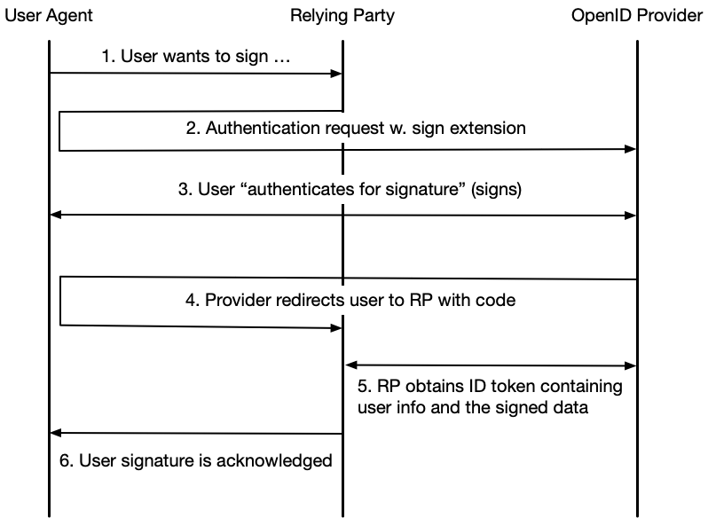

# Signature Extension for OpenID Connect

### Version: 1.0 - draft 02 - 2023-04-05

## Abstract

This specification defines an extension to OpenID Connect to facilitate the use cases where a Relying Party sends a
"Signature Request" to an OpenID Provider. A signature request is an extension of an OpenID Connect authentication
request where a "Signature Request" object is passed as a request parameter or a Request Object.


## Table of Contents

1. [**Introduction**](#introduction)

    1.1. [Requirements Notation and Conventions](#requirements-notation-and-conventions)
    
2. [**The Use Case**](#the-use-case)
    
3. [**Identifiers**](#identifiers)
    
    3.1. [The Signature Request Parameter](#the-signature-request-parameter)
    
    3.1.1. [Placement of the Parameter in an Authentication Request](#placement-of-the-parameter-in-an-authentication-request)
    
    3.1.2. [Security Requirements](#security-requirements)
        
    3.2. [Signature Scope](#signature-scope)

4. [**Relying Party Requirements**](#relying-party-requirements)

    4.1. [Requests](#requests)
    
    4.1.1. [Requirements on Signing User](#requirements-on-signing-user)

5. [**OpenID Provider Requirements**](#openid-provider-requirements)
    
    5.1. [Processing Requirements](#processing-requirements)
    
    5.2. [Response Requirements](#response-requirements)
        
    5.3. [Discovery](#discovery)

6. [**Normative References**](#normative-references)

---

<a name="introduction"></a>
## 1. Introduction

This specification defines an extension to OpenID Connect to facilitate that a user digitally signs data provided by
a Relying Party at the OpenID Provider.

The rationale behind this specification is that the OIDC Sweden Working Group has seen the need to offer a standardized
OpenID Connect way of handling both authentication and signature since most eID providers in Sweden supports both
authentication and signing.

This specification should not be seen as a competitor to any of the full-blown signature specifications such as
[OASIS DSS](https://www.oasis-open.org/committees/tc_home.php?wg_abbrev=dss), but instead as the OpenID Connect-equivalent
to the proprietary API:s offered by eID providers. In fact, this specification says nothing about signature formats,
validation or any other part of the complex world of digital signatures. 

**Note:** This specification is written in the context of the [The Swedish OpenID Connect Profile](#oidc-profile), 
\[[OIDC.Sweden.Profile](#oidc-profile)\], and therefore compliance with this specification also requires
compliance with \[[OIDC.Sweden.Profile](#oidc-profile)\].


<a name="requirements-notation-and-conventions"></a>
### 1.1. Requirements Notation and Conventions

The key words “MUST”, “MUST NOT”, “REQUIRED”, “SHALL”, “SHALL NOT”, “SHOULD”, “SHOULD NOT”, “RECOMMENDED”, “MAY”, and
“OPTIONAL” are to be interpreted as described in \[[RFC2119](#rfc2119)\].

These keywords are capitalized when used to unambiguously specify requirements over protocol features and behavior that
affect the interoperability and security of implementations. When these words are not capitalized, they are meant in 
their natural-language sense.

<a name="the-use-case"></a>
## 2. The Use Case

The use case that this profile seeks to find an OpenID Connect solution to is as follows:

The Relying Party delegates the signing operation to the OpenID Provider by sending an authentication request with a
sign extension. The flow below illustrates each step in for this delegated signing model.



1. The user wants to sign something at the Relying Party, for example a form, and clicks "Sign".

2. The Relying Party (client) initiates an "authentication for signature" by redirecting the user to the OpenID Provider
along with an authentication request containing a sign extension (see [section 3.1](#the-signature-request-parameter) below).

3. During the authentication/signing the user actually performs a signature of the "to-be-signed" data that was
supplied as an extension to the authentication request. In this step the OpenID Provider also displays a summary of what
is being signed.

4. After a completed signature operation the user agent is redirected back to the client along with an authorization code.

5. Next, the client obtains an ID token that contains information about the signee along with the signed data.

6. Finally, the completed signature operation is acknowledged to the user.

The advantage with this use case is that it is simple and straightforward. The disadvantage is that only OpenID Providers
that actually supports eID:s that support creating signatures can be used.

<a name="identifiers"></a>
## 3. Identifiers

This section extends \[[OIDC.Sweden.Attr](#attr-spec)\] with definitions of parameter claims and scopes used for the signing
use case defined in this specification.

<a name="the-signature-request-parameter"></a>
### 3.1. The Signature Request Parameter

**Parameter:** `https://id.oidc.se/param/signRequest`

**Description:** The signature request parameter is included in an authentication request by the Relying Party in order
to request a user signature. The signature request parameter contains input for this signature operation.

**Value type:** The value for the signature request parameter claim is a JSON object<sup>1</sup> with the following fields:

- `tbs_data` - The data to be signed as a Base64-encoded string. This specification does not specify the format on the supplied data. It is regulated by the signature scheme being used. This field is mandatory.

- `sign_message` - A sign message is the human readable text snippet that is displayed to the user as part of the signature process<sup>2</sup>. The `sign_message` field is a JSON object according to the `https://id.oidc.se/param/userMessage` request
parameter as defined in section 2.3.1 of \[[OIDC.Sweden.Profile](#oidc-profile)\]. This field is mandatory.

**Example:**

```
...
"https://id.oidc.se/param/signRequest" : {
  "tbs_data" : "<Base64-encoded data>",
  "sign_message" : {
    "message" : { 
      "sv" : "<Base64-encoded sign message in Swedish>",
      "en" : "<Base64-encoded sign message in English>"
    },
    "mime_type" : "text/plain"
  }
},
...
```

> **\[1\]:** Depending on where in a request the parameter is placed, the value may be a JWT, see [section 3.1.1](#placement-of-the-
parameter-in-an-authentication-request) below. 

> **\[2\]:** Whether the contents of the sign message is part of the signature input data at the OpenID Provider or not is not regulated by this profile.

<a name="placement-of-the-parameter-in-an-authentication-request"></a>
#### 3.1.1. Placement of the Parameter in an Authentication Request

The `https://id.oidc.se/param/signRequest` request parameter, can be provided in an authentication
request in two ways; as a custom request parameter where its value is represented as a JWT, or as part of a Request Object 
that is the value to the `request` (or `request_uri`) parameter.

<a name="as-a-custom-request-parameter"></a>
##### 3.1.1.1. As a Custom Request Parameter

If the sign request parameter is included as a custom request parameter its value MUST be represented as a JWT following 
the security requirements specified in [section 3.1.2](#security-requirements) below.

Below follows a minimal, and non-normative, example redirect by the client, which triggers the user agent to make a
"signature"<sup>1</sup> request to the authorization endpoint: 

```
HTTP/1.1 302 Found
Location: https://server.example.com/authorize?
  response_type=code
  &scope=openid%20https%3A%2F%2Fid.oidc.se%2Fscope%2Fsign
  &client_id=exampleclientid
  &state=af0ifjsldkj
  &prompt=login%20consent
  &redirect_uri=https%3A%2F%2Fclient.example.org%2Fcb
  &https%3A%2F%2Fid.oidc.se%2Fclaim%2FsignRequest=eyJhbjIn0.ew0...MbpL-2QgwUsAlMGzw
```

The scopes requested are `openid` (always) and `https://id.oidc.se/scope/sign` (see [section 3.2](#signature-scope), 
[Signature Scope](#signature-scope))  that instructs the OpenID Provider that this is a signature request. 
In a real-life scenario, the Relying Party would probably request additional claims using additional scopes, for example,
 `https://id.oidc.se/scope/naturalPersonNumber` and `https://id.oidc.se/scope/authnInfo` (see \[[OIDC.Sweden.Attr](#attr-spec)\]).

The parameter `https://id.oidc.se/param/signRequest` is among the parameters and its value is a JWT
(abbreviated for readability). This parameter value holds the input to the signature operation.

> **\[1\]:** There is no such thing as an OpenID signature request. The example is really an authentication request
carrying the signature request parameter.

<a name="placed-in-a-request-object"></a>
##### 3.1.1.2. Placed in a Request Object

The signature request parameter and value can also be part of a Request Object JWT that is the value for the `request` (or `request_uri`) parameter. 

Since the Request Object is a JWT, the value for the signature request parameter is in these cases a JSON object.

See section 6, "Passing Request Parameters as JWTs", in \[[OpenID.Core](#openid-core)\] for details. 

**Note:** It is perfectly legal to create a request where some parameters are assigned as regular request parameters 
and some are included in the Request Object. However, since the Request Object MUST be signed (see below) the `iss` 
(issuer) and `aud` (audience) claims MUST be included in the Request Object. 

The following is a non-normative example of the claims in a Request Object before Base64, URL-encoding (and signing): 

```
{
  "iss": "exampleclientid",
  "aud": "https://server.example.com",
  "response_type": "code",
  "redirect_uri": "https://client.example.org/cb",
  "scope": "openid https://id.oidc.se/scope/sign",
  "prompt": "login consent"
  "https://id.oidc.se/param/signRequest": {
    "tbs_data" : "VGhpcyBpcyB0aGUgZGF0YSB0aGF0IEkgd2FudCB0byBzaWdu",
    "sign_message" : {
      "message" : { 
        "sv" : "RGVubmEgdGV4dCB2aXNhcyBmw7ZyIGFudsOkbmRhcmVu",
        "en" : "VGhpcyBpcyB0ZXh0IGRpc3BsYXllZCBmb3IgdGhlIHVzZXI="
      },
      "mime_type" : "text/plain"
    }
  }
}

```

When the client creates a redirect response, which triggers the user agent to make an "signature"<sup>1</sup> request
to the authorization endpoint it looks like:

```
HTTP/1.1 302 Found
https://server.example.com/authorize?
  response_type=code
  &client_id=exampleclientid
  &scope=openid%20https%3A%2F%2Fid.oidc.se%2Fscope%2Fsign
  &state=af0ifjsldkj
  &nonce=n-0S6_WzA2Mj
  &request=eyJhbGciOiJSUzI1NiIsImtpZCI6ImsyYmRjIn0.ew0KICJpc3MiOiAiczZCaGRSa3...xMbpL-2QgwUsAlMGzw
```

The example illustrates how a Request Object is passed by value. See section 6.2, "Passing a Request Object by Reference", in \[[OpenID.Core](#openid-core)\] for how to use the `request_uri` instead.

> **\[1\]:** There is no such thing as an OpenID signature request. The example is really an authentication request
carrying the signature request parameter.

<a name="security-requirements"></a>
#### 3.1.2. Security Requirements

The contents of the `https://id.oidc.se/param/signRequest` parameter hold the data to be signed, and it is essential
that no party can alter this while the request message is in transit. Therefore, the following security requirements
apply for Relying Parties and OpenID Providers that are compliant with this specification:

* If the signature request parameter is included as a custom request parameter (see [3.1.1.1](#as-a-custom-request-parameter) 
above), its value represented as a JWT MUST be signed by the client's registered key, and MAY be encrypted to the recipient's
registered public key.

* If the signature request parameter is part of a Request Object according to section [3.1.1.2](#placed-in-a-request-object)
above, the entire Request Object JWT MUST be signed by the client's registered key, and MAY be encrypted to the recipient's
registered public key. 

<a name="signature-scope"></a>
### 3.2. Signature Scope

**Scope:** `https://id.oidc.se/scope/sign`

**Description:** The scope has two purposes; it indicates for the OpenID Provider that the request in which the scope is
included is a "signature request", and it requests the claims declared in the table below.

| Claim | Description/comment | Reference | Requirement |
| :--- | :--- | :--- | :--- |
| `https://id.oidc.se/`<br />`claim/userSignature` | The signature that is the result of the user signing process at the OP. | \[[OIDC.Sweden.Attr](#attr-spec)\] | REQUIRED |
| `auth_time` | The time where the signature was created. | \[[OpenID.Core](#openid-core)\] | REQUIRED |

**Note:** The `https://id.oidc.se/scope/sign` alone does not say anything about the identity of the signing end-user.
A Relying Party wishing to get this information, which it most likely does, should include additional scopes in the 
request that declares which identity claims that are wanted. 


<a name="relying-party-requirements"></a>
## 4. Relying Party Requirements

<a name="requests"></a>
### 4.1. Requests

A Relying Party wishing to issue a request for signature according to the specification MUST include 
`https://id.oidc.se/scope/sign` along with the mandatory `openid` as values to the `scope` request parameter. 

A request for signature MUST contain the [Signature Request Parameter](#the-signature-request-parameter) and its
inclusion in the request MUST follow the requirements stated in sections [3.1.1](#placement-of-the-parameter-in-an-authentication-request), [Placement of the Parameter in an Authentication Request](#placement-of-the-parameter-in-an-authentication-request) and [3.1.2](#security-requirements), [Security Requirements](#security-requirements).

The authentication request MUST contain the `prompt` parameter<sup>1</sup> and its value MUST be include both the 
`login` and `consent` parameter values.  The reason for this is that a signature must never be generated based on a previous authentication (`login`) and that the Relying Party wants to ensure that the user actually sees the sign message and understands
that he or she is performing a signature operation (`consent`).

The Relying Party SHOULD examine the discovery document regarding supported MIME types for the `sign_message` field of the
`https://id.oidc.se/param/signRequest` request parameter value (see [section 5.3](#discovery)), and only use a MIME
type supported by the OpenID Provider. If no such information is available in the OP discovery document, the Relying 
Party SHOULD use the MIME type `text/plain` for the sign message. 

> **\[1\]:** The `prompt` parameter can be provided either as an ordinary request parameter or as a field in a Request Object.

<a name="requirements-on-signing-user"></a>
#### 4.1.1. Requirements on Signing User

In most cases a user is already logged into the service that wants the user to sign some data, for example an approval or 
a document. The data that is to be signed can be sensitive, and the service will need to ensure that only the intended user
can view this data.

If a Relying Party wanting to bind a signature operation to a particular identity SHOULD assign the necessary identity
claim(s) to the `claims` request parameter and for each claim set the `essential` field to `true` and the `value` field 
to the required identity value. See chapter 5.5.1 of \[[OpenID.Core](#openid-core)\].

Request Object example of how we request that the signature is for the given user having the supplied personal identity 
number (URL-encoding not applied for readability reasons): 

```
{
  ...
  "claims" : {
    "id_token" : {
      "https://id.oidc.se/claim/personalIdentityNumber" : {
        "essential" : true,
        "value" : "196903261687"
      }
    }
  },
} 
```

<a name="openid-provider-requirements"></a>
## 5. OpenID Provider Requirements

This section contains requirements for OpenID Providers compliant with this specification.

<a name="processing-requirements"></a>
### 5.1. Processing Requirements

An OpenID Provider receiving a request containing the `https://id.oidc.se/scope/sign` value among the `scope` request
parameter values MUST ensure the following:

- That the request also contains the `https://id.oidc.se/param/signRequest` request parameter.

- That the `https://id.oidc.se/param/signRequest` value is signed and that the signature can be successfully verified. See
[section 3.1.2](security-requirements), [Security Requirements](#security-requirements).

- That the `prompt` parameter is present and contains the `login` and `consent` values.

If any of the above requirements fail, an error response where the error code is `invalid_request`<sup>1</sup> MUST be sent.

If the OpenID Provider receives an authentication request containing the `https://id.oidc.se/param/signRequest` request
parameter and the `scope` parameter does not include the `https://id.oidc.se/scope/sign` value, the OP MAY ignore
the `https://id.oidc.se/param/signRequest` request parameter, or respond with an error.

If the request for signature contains a `claims` parameter<sup>2</sup> holding identity value(s) marked as `essential` (see 
[section 4.1.1](#requirements-on-signing-user) above), the OpenID Provider MUST NOT display the supplied sign message
or initiate the signature operation before the user's identity has been proven to match these value(s). If the user
identity does not match the supplied value(s) in the `claims` parameter, an error response MUST be sent.

The processing of the supplied signature message (`sign_message` field of the `https://id.oidc.se/param/signRequest` parameter)
MUST follow the requirements stated in section 2.3.1 of \[[OIDC.Sweden.Profile](#oidc-profile)\]. If the message for
some reason can not be displayed<sup>2</sup>, the the signature operation MUST be rejected (and an error message sent).

The OpenID Provider SHOULD NOT save the user's signature operation in its session at the OP for later re-use in SSO-scenarios.
The reason for this is that a signature operation is inheritely non-SSO, and authentication and signature operations should
not be mixed.

> **\[1\]:** See section 4.1.2.1 of \[[RFC6749](#rfc6749)\].

> **\[2\]:** An OpenID Provider compliant with this specification MUST also be compliant with 
\[[OIDC.Sweden.Profile](#oidc-profile)\], and \[[OIDC.Sweden.Profile](#oidc-profile)\] requires OpenID Providers to 
support the `claims` request parameter.

> **\[3\]:** For example an unsupported MIME type was specified.

<a name="response-requirements"></a>
### 5.2. Response Requirements

Claims that are representing the result of a signature operation, such as the `https://id.oidc.se/claim/userSignature`
claim, MUST be delivered in the ID Token and never from the UserInfo endpoint.

<a name="discovery"></a>
### 5.3. Discovery

OpenID Providers that supports the OpenID Connect Discovery standard, \[[OpenID.Discovery](#openid-discovery)\] and are compliant with this specification<sup>1</sup>, MUST meet the following requirements:

The `scopes_supported` MUST be present in the provider's discovery document and it MUST contain the scope 
`https://id.oidc.se/scope/sign`.

Also, it is RECOMMENDED that the `https://id.oidc.se/scope/authnInfo` scope is supported and declared. See \[[OIDC.Sweden.Attr](#attr-spec)\].

The `claims_supported` field MUST be present and include at least the claims that are included in the scope definitions for all
declared scopes (in the `scopes_supported`).

The `request_parameter_supported` MUST be present, and SHOULD be set to `true` (i.e., the OpenID Provider has support for 
handling signature requests sent by value as Request Objects).

The `request_uri_parameter_supported` MUST be present, and it is RECOMMENDED that it is set to `true` (i.e., the OpenID Provider
has support for handling signature requests sent by reference as Request Objects).

As already stated in section 5.2 of \[[OIDC.Sweden.Profile](#oidc-profile)\], the `claims_parameter_supported` SHOULD be present
and set to `true`.

Support of sign messages during a signature operation is REQUIRED by this specification. It is RECOMMENDED that
the OpenID Provider also supports displaying of "client provided user messages", as defined in section 2.3.1
of \[[OIDC.Sweden.Profile](#oidc-profile)\]. This capability is declared using the discovery parameter
`https://id.oidc.se/disco/userMessageSupported` (see section 5.3.1 of \[[OIDC.Sweden.Profile](#oidc-profile)\]).
This effectively means that the OP supports displaying of user messages also when the user authenticates 
(as opposed to signs).

The `https://id.oidc.se/disco/userMessageSupportedMimeTypes` field, defined in section 5.3.1 of 
\[[OIDC.Sweden.Profile](#oidc-profile)\], SHOULD be used to declare which MIME types that are supported regarding the 
`sign_message` field of the `https://id.oidc.se/param/signRequest` parameter value. If not declared, `[ "text/plain" ]` 
MUST be assumed.

> **\[1\]:** An OpenID Provider compliant with this specification MUST also be compliant with 
\[[OIDC.Sweden.Profile](#oidc-profile)\] and thus meet the requirements stated in section 5.2 of that profile.

<a name="normative-references"></a>
## 6. Normative References

<a name="rfc2119"></a>
**\[RFC2119\]**
> [Bradner, S., Key words for use in RFCs to Indicate Requirement Levels, March 1997](https://www.ietf.org/rfc/rfc2119.txt).

<a name="rfc6749"></a>
**\[RFC6749\]**
> [RFC6749 - The OAuth 2.0 Authorization Framework, October 2012](https://www.rfc-editor.org/rfc/rfc6749).

<a name="openid-core"></a>
**\[OpenID.Core\]**
> [Sakimura, N., Bradley, J., Jones, M., de Medeiros, B. and C. Mortimore, "OpenID Connect Core 1.0", August 2015](https://openid.net/specs/openid-connect-core-1_0.html).

<a name="openid-discovery"></a>
**\[OpenID.Discovery\]**
> [Sakimura, N., Bradley, J., Jones, M. and E. Jay, "OpenID Connect Discovery 1.0", August 2015](https://openid.net/specs/openid-connect-discovery-1_0.html).

<a name="rfc7515"></a>
**\[RFC7515\]**
> [Jones, M., Bradley, J., and N. Sakimura, “JSON Web Token (JWT)”, May 2015](https://tools.ietf.org/html/rfc7515).

<a name="attr-spec"></a>
**\[OIDC.Sweden.Attr\]**
> [Attribute Specification for the Swedish OpenID Connect Profile](https://github.com/oidc-sweden/specifications/blob/main/swedish-oidc-attribute-specification.md).

<a name="oidc-profile"></a>
**\[OIDC.Sweden.Profile\]**
> [The Swedish OpenID Connect Profile](https://github.com/oidc-sweden/specifications/blob/main/swedish-oidc-profile.md).


