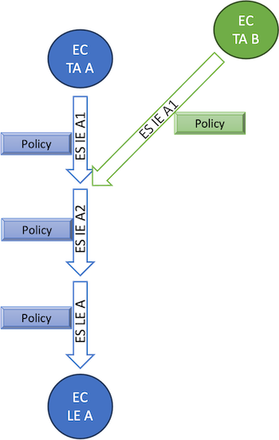

# The Swedish OpenID Federation Profile - Challenges and Requirements

### 2024-06-14

## Abstract

This document addresses challenges when applying the OpenID federation draft standard
[https://openid.net/specs/openid-federation-1_0.html](https://openid.net/specs/openid-federation-1_0.html)
to a Swedish profile for OpenID federation based on the [introduction document](swedish-oid-fed-introduction.md).
A number of requirements for the [Swedish OpenID Federation Profile](swedish-oidc-fed-profile.md) are specified as the means to meet these challenges.

## 1. Complexity for Federation Services

The full implementation of the current standard presents a significant barrier to entry for federation services desiring to engage with this federation infrastructure. This complexity barrier arises from:

- The relatively intricate process required to gather and validate trusted information about other federation services.
- The obligation to publish a self-signed Entity Configuration statement at a designated location within their Entity Identifier URL.

Mitigating the first issue can be relatively straightforward, provided all federation entities have access to a Resolver capable of managing this task on their behalf.

The second issue, however, is more complex but may be significantly improved by delegating publication of Entity Configuration at the registration Intermediate Entity

A trust chain supporting a federation service might appear as follows:

- TA self-signed Entity Configuration (Directly trusted)
- TA Entity Statement for IE 1
- IE 1 Entity Statement for IE 2
- IE 2 Entity Statement for Federation Service A
- Federation Service A self-signed Entity Configuration

When the Entity Configuration is published at a ./well-known location under its Entity Identifier URL, this federation service
is discoverable using the bottom-up strategy.

The situation for federation services can, however, be simplified significantly if they only need to be discoverable via a resolver that applies a top-down strategy. This means that they do not have to comply with any requirement to publish the Entity Configuration at a ./well-known location, which has a number of desirable down-stream effects:

- Creation, signing and publication of all data of the federation service can be delegated to an Intermediate Entity
- The service can keep its current Entity Identifier without having to provide a ./well-known URL based on that Entity Identifier.

Federation services that could be suitable for this type of simplified registration are typically a Relying Party service that only interacts with a limited set of OP services that are using a suitable resolver to locate their metadata. Such RP could easily opt for a simpler registration strategy without any negative side effects. If such RP need to change this strategy in the future, they would have to change strategy and comply with the full set of requirements for bottom-up discovery.

Support of this simplified option can be achieved by an extension to the OID federation standard in the form of a new critical extension claim for Entity Statements that specifies the URL for locating the Entity Configuration of an entity using top-down discovery.

### 1.1. Requirements for the Swedish profile

#### 1.1.1. Amendments to OpenID federation

The standard should be amended to support hosted publication of Entity Configuration at a selected URL independent of the Entity Identifier.

This is achieved by defining a new Entity Statement claim providing information about the location of subject Entity Configuration.
This new Entity Statement claim shall contain information about where the subject Entity Configuration statement is located:

- At a specific ./well-known location as required by the standard:
- At a location specified by another URL

The URL MAY be a URL using the data url scheme that embeds the actual entity configuration in the URL.

#### 1.1.2. Requirements to ensure availability of Resolvers

The Swedish profile should contain the following requirements:

- At least every federation node acting as a TA SHOULD ensure the availability of at least one Resolver that can resolve federation data to that TA
- The federation resolver of a TA SHOULD be either the TA itself or a registered entity directly under the TA

Federations that do not provide resolvers MUST support bottom-up discovery of all federation entities.

## 2. Policy processing in multi federation setups

There is a collective agreement that the current merge algorithm is well-designed and useful in a single federation.
It does a great job to ensure that subordinate entities provide a policy that is kept within the limitations of any superior entity they chain to.

There may be challenges, however, to make this work in multi-federation setups where many federations need to:

- Enforce local policy rules independent of each other.
- Allow services that meet the requirement of another federation to participate in that federation without having to re-enroll in that federation separately.

### 2.1. Challenge example: Requirements on client authentication methods

In this example a local federation has OIDC RP:s that only support `client_secret_post` while others support `private_key_jwt` as
token endpoint authentication method.
Some services in this federation need to access services in a national eID federation where there is a requirement to use
only `private_key_jwt`.

The requirements imposed by both federations are realistic and reasonable for their local context.

To enforce these rules,
the local federation provides a policy for `token_endpoint_auth_methods_supported` with the policy operator `superset_of` set to
`["client_secret_post", "private_key_jwt"]`.
This enforces all OP:s in this federation to support both `client_secret_post` and `private_key_jwt` in order to support their
RP:s that can only do client secret.
They opt to not use `subset_of` as they don't want to restrict other authentication methods,
just to enforce that these two are supported.

The national eID federation provides a policy for the same metadata parameter but with the intention to restrict values to only
`private_key_jwt`.
The TA can enforce this policy by setting the policy operator `subset_of` to the value `"private_key_jwt"w` in combination with setting
the policy operator `essential` to true.
This will filter out any options supported by any OP other than the value `private_key_jwt` and ensures that the policy check will fail if
no value is present.
This means that only OP:s that support `private_key_jwt` will be accepted.

The problem is however that when the policy of the eID federation is merged with the policy of the local federation,
it will produce a merged policy that has both `superset_of` set to {`client_secret_post`, `private_key_jwt`} and `subset_of` set to the
value `private_key_jwt`.
This is an illegal combination and policy merge will fail since `subset_of` must be a superset of `superset_of`.
That is, the mandated minimum value set declared by `superset_of` must all be members of the maximum set declared by `subset_of`

In conclusion, these policies are realistic and reasonable withing their context,
but they are incompatible with each other and can never exist in the same chain of statements.

### 2.2.2 Allowing TA:s to express independent policies

The manner in which the OpenID federation standard can be used to allow independent policies without causing unintentional merge conflicts,
is to use alterantive chain paths where independent and incompatible policies never have to be merged, as shown in the following illustration.

The OpenID federation standard facilitates the implementation of independent policies without leading to unintentional merge conflicts by utilizing alternative chain paths.
This approach ensures that independent and incompatible policies remain separate,
thus avoiding the need for merging. The concept is illustrated below.

**Note:** _Circles named EC = Entity Configuration, Arrows named ES = Entity Statement issued to the indicated entity by its superior entity_

This example shows two chains to validate Leaf Entity A (LE A)

- Entity Configuration for Trust Anchor A (TA A)
- Entity Statement issued by TA A for Intermediate Entity A1 (IE A1)
- Entity Statement issued by IE A1 for Intermediate Entity A2 (IE A2)
- Entity Statement issued by IE A2 for Leaf Entity A (LE A)
- Entity Configuration for Leaf Entity A (LE A)

The alternative chain is

- Entity Configuration for Trust Anchor B (TA B)
- Entity Statement issued by TA B for Intermediate Entity A1 (IE A1)
- Entity Statement issued by IE A1 for Intermediate Entity A2 (IE A2)
- Entity Statement issued by IE A2 for Leaf Entity A (LE A)
- Entity Configuration for Leaf Entity A (LE A)

The policies along the path vary based on the Trust Anchor (TA) selected by the relying party.
This flexibility permits TAs to enforce completely different independent policies,
provided these policies can be merged with all other policies within their respective paths.

In the context of the challenge discussed in section 2.1,
this approach enables one Trust Anchor (TA) to mandate the support of both `client_secret_post` and `private_key_jwt`,
while another TA may require that only `private_key_jwt` is allowed.
If Leaf Entity A supports both authentication methods, it can comply with both sets of policies.
When Leaf Entity A is validated through the first TA,
its metadata will reflect both authentication options.
When validated through the second TA,
only the `private_key_jwt` method will be listed in its metadata.

### 2.3. Requirements for the Swedish profile

It will be essential to build the federation infrastructure in a way that allows interconnection of federation services when needed without
causing policy merge conflicts.

To achieve this the Swedish profile should include the following recommendations

- Apply all essential policies at each Trust Anchor and not in Entity Statements issued by Intermediate Entitites.
- Avoid issuing Entity Statements for Leaf Entities directly from Trust Anchors.
- Consolidate federation services of different types under a common Intermediate Entity that allows them to be chained effectively to multiple Trust Anchors when relevant.

## 3. Metadata policy expression

The OpenID federation draft standard defines the following policy operators:

| Operator    | Definition                                                                                       |
| ----------- | ------------------------------------------------------------------------------------------------ |
| value       | Sets a specific value, regardless of whether metadata already has this parameter present or not. |
| add         | Add this value if not already present.                                                           |
| default     | If no value is present (after processing value and add) set this default value.                  |
| essential   | Requires a value to be present.                                                                  |
| one_of      | The value must be exactly one of the listed values.                                              |
| subset_of   | Express a maximum value set. All metadata parameter values are restricted to this set.           |
| superset_of | Express a minimum value set. The metadata parameter must contain these values                    |

### 3.1. Problem with value modifiers

These operators are of three types:

- value modifier: Has the capability to change the value to a value that is different from what was declared in the original metadata
- value restriction: Has the capability of restricting the value defined in original metadata to a subset of the originally declared options
- value checks: Test the original metadata for compliance, but makes no attempts to modify any metadata.

`value`, `add` and `default` are value modifiers, `subset_of` is a value restriction, and the rest are value checks.

The problem with value modifiers is that they can be dangerous if used inappropriately,
and that they introduce complexity for federation services.

- a value modifier may introduce a value that claims that the entity supports something that this entity actually does not support.
- The fact that policy can change metadata parameter values may require all federation services to assess what their resolved metadata is at each TA

Value modifiers are not necessary as there exist other ways to enforce metadata values.
When the superior entity (Intermediate or Trust Anchor) registers a federation service,
it has the option in its issued Entity Statement to set specific metadata values for the federation service.
This can be done individually for each registered federation service and in close cooperation with that service.
This should be a safer and more appropriate way to set specific metadata values than to do it by value modifiers in policy.

### 3.2. Define new value checks

The standard allows the definition of custom policy operators.
This can become useful since the default policy operators are somewhat limited.
Below are two additional value checks that are discussed for inclusion in the standard:

**Intersects**

The current operators are not able to handle the requirement where the metadata parameter must contain at least one of a set of supported values,
without restricting what values that can be set.

An example of this is a requirment that OPs must support either "Loa 3" or "eIDAS substantial",
but they are allowed to support others as well (e.g. LoA 2).

There is a proposal for the OpenID federation draft standard to include a new operator `intersects` for this purpose.
The `intersects` operator holds a list of values.
This value check is satisfied if the metadata parameter includes at least one of the listed values.

**Regexp**

The current version of the draft standard includes the example of a policy operator `regexp`.
However, this operator is only included as an example of a custom operator and is not defined in the standard.
This value check could, however, be very useful to enforce parameter structure requirements.
One useful application could be to provide a "regexp" value check to enforce that metadata values holding a URL has the basic structure of a URL.

### 3.3. Requirements for the Swedish profile

- State that value modifiers that add values not specified by the target entity SHOULD NOT be used
- Define the following custom policy operators (unless defined in the core standard):
  - `intersects`
  - `regexp`

## 4. Discovery support

The Resolver as specified by the OpenID federation draft standard only defines an API for resolving a specific EntityID to a specified TA.
There is also a request parameter to specify the entity type, but this will only limit the set of metadata returned for that entity in case
this entity serves multiple roles.

There is currently no defined API to request a list of resolvable entities of a specified type from the Resolver.
This is considered essential to allow services to build a list of selectable services in a discovery UI,
such as allowing an RP to show a list of available OPs.

### 4.1. Requirements for the Swedish profile

Define a discovery endpoint for Resolvers that provides a list of resolvable entities (List of Entity Identifiers)

**Input parameters**

- `trust_achor` - EntityID of Trust Anchor
- `entity_types` - Identifier of the requested entity types
- `trust_marks` - List of Trust Mark identifiers that must be supported

**Output**

List of resolvable Entity Identifiers matching the request.

## 5. Complete metadata for each entity type

The current standard defines a generic set of metadata parameters that can be included in metadata for any entity type.
This metadata can be defined in the entity type "Federation Entity" which is an entity type that is used by federation nodes
that does not provide any federation service, but only provides federation roles such as TA, IE, Resolver or Trust Mark issuer.

There is currently an option to store the common metadata parameters in "Federation Entity" metadata also when the
entity is just a federation service, such as an OP or an RP. However, that has several negative consequences.

The major problem is that metadata for the entity gets divided between several entity types and that is not compatible with
the current Resolver API. If federation data is requested by a resolver and entity type is specified to OP, then only
OP metadata will be returned and not the common relevant metadata parameters stored under the "Federation Entity" type.

### 5.1. Requirements for the Swedish profile

All metadata parameters that are relevant for a federation service MUST be provided in the metadata for the entity type of that service.

## 6. Mutliple RP/Client metadata options

Client and RP metadata parameters were originally designed to match only a signle peer entity. This is evident by metadata parameters such as:

- token_endpoint_auth_method
- id_token_signed_response_alg

These metadata parameters can only provide one value, which makes sense if the metadata express the selected option for a particular OP, which capabilities are known in advance. However, this is less useful for expressing the capability or preference of an RP as a declaration towards mulitple OP:s in a federation environment.

### 6.1. Metadata parameter array extension

This section outlines a proposal for a generic metadata extension for Client/RP metadata that can be handled completely transparently by the OIDC fed standard. This is called the metadata parameter array extension and can be provided as a separate extension to OIDC RP and OAuth Client metadata as follows:

**Array name extension**

Each metadata parameter name that provides a single value, where the RP/Client which to provide a list of acceptable values in the order of preference, that metadata parameter name can be extended by the string "[]". This forms the name of a companion metadata parameter with an array of values.

Example 1:

> "token_endpoint_auth_method": "client_secret_post"
> "token_endpoint_auth_method[]": ["private_key_jwt","client_secret_post"]

Example 2:

> "id_token_signed_response_alg": "RS256"
> "id_token_signed_response_alg[]": ["RS256","ES256"]

The semantics of these declarations are that the original parameter name is used by all legacy peers and is treated according to standard. Peers that suppor the metadata parameter array extension MAY use the corresponding parameter with the "[]" name extension to learn about the client/RP capabilities in the order of preference. If used, the array extension parameter overrides the original parameter.

**OP/AS support**

An OP may signal support for metadata parameter array extension in RP/Client metadata by including the following metadata parameter:

> "supports_metadata_parameter_array_extension": true

### 6.2. Requirements for the Swedish profile

No actions for the Swedish profile for OIDC federation. The solution outlined above works with standard OIDC federation metadata processing.

A separate specification covering this issue should be created to support the Swedish OpenID Connect profile.

