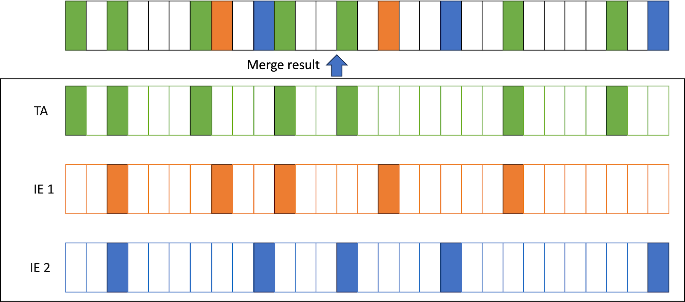

# The Swedish OpenID Federation - Challenges and Requirements

### 2023-12-11

## Abstract

This document addresses challenges when applying the OpenID federation draft standard
[https://openid.net/specs/openid-federation-1_0.html](https://openid.net/specs/openid-federation-1_0.html)
to a Swedish profile for OpenID federation based on the [introduction document](swedish-oid-fed-introduction.md).
A number of requirements for the [Swedish OpenID Federation Profile](swedish-oidc-fed-profile.md) are specified as the means to meet these challenges.

## Reducing complexity for federation services

Reducing complexity for participating federation services is regarded as a critical success factor. A requirement on federation services
to be able to correctly implement chain validation is likely a major deployment obstacle. In particular for services that attempt to use
standard of-the-shelf products for OIDC integration.

The following aspects are identified as important for reducing complexity:

- Federation data discovery, retrieval and validation
- Registration and provision of a self-signed Entity Statement

### Hosting Entity Configuration data

Some federation services may not have the capability to create or publish Entity Configuration data. This may be caused by limitations
of the federation service software but could also be the case for clients that do not have a static IP such as public OAuth clients.

It has therefore been discussed among the editors of OpenID federation that such an Entity Configuration could be hosted by the superior
Intermediate entity that has registered the entity.
As the Entity Configuration must be located at a URL constructed from the Entity Identifier of the entity,
the Entity Identifier must also be provided by the superior Intermediate entity.
The problem remains, however, that this Entity Configuration must be signed by the federation key of the entity.
This may be challenging as this will require the entity to have software for signing that has access to the entity federation key.

There is an ongoing discussion with the editors if it could be possible to delegate the signing of the Entity Configuration to the
superior Intermediate Entity.
Another option would be to publish the Entity Statement issued by the superior Intermediate Entity as the Entity Configuration of the entity.

### Requirements for the Swedish profile

- At least every federation node acting as a TA MUST ensure the availability of at least one Resolver that can resolve federation data to that TA
- The federation resolver of a TA MUST be either the TA itself or a registered entity directly under the TA

It is important to offer registration options to federation services that allow enrollment of service entities that do not have the
capability to generate or publish Entity Configuration on their own. For many reasons, however, the Swedish profile should avoid to mandate any
particular registration process as the manner in which this is offered may have a lot of variations depending on the type of entity. Some
entities, such as mobile public OAuth clients, may, for example, not have any capability at all to publish data.

The Swedish profile should provide guidance on this without stipulating any requirements.

It is, however, important to follow the resolution of requirement to sign Entity Configuration with the entity federation key,
as this influences this guidance.

## Policy processing in multi federation setups

There is currently a major discussion concerning the defined policy processing algorithm in chain validation.
The current algorithm requires that all policies in the path are merged into a single policy.

The full merge process is illustrated in the following image:

A metadata policy consists of a list of metadata parameter policies. E.g. the policy parameter `acr_values_supported` can have one
metadata parameter policy and `response_types_supported` can have another policy. Each metadata parameter policy consists of one or
more policy operators further elaborated in the section "Metadata policy expression" below.

The merge algorithm merges all individual policy operators of each metadata parameter policy into a merged metadata parameter policy.
The result of such merge policy can lead to the following results:

- The new merged policy is a legal combination of the merged policies
- Merge error caused by conflicting policy operators

When merge is successful, the result is a new policy that is different from the policies being merged.
This creates a challenge for a superior entity that wants to apply specific policy rules as they may be changed in the policy merge process.

A summary of the challenges that arise from this merge process is that:

- The TA has no way to control what the applied policy will be, since it can be changed by subordinate entities
- Many combinations of policies can't be merged without causing merge errors
- The standard allows the creation of custom policy rules, but not all rules can be merged in any meaningful way.

The current merge algorithm is designed for single federations where all federation nodes can be managed and aligned by a single
administrative entity, but it becomes quite challenging in multi federation setups.

### Example of challenges - Requirements on client authentication methods

In this example a local federation has OIDC RP:s that only support `client_secret_post` while others support `private_key_jwt` as
token endpoint authentication method.
Some services in this federation need to access services in a national eID federation where there is a requirement to use
only `private_key_jwt`.

The requirements imposed by both federations are realistic and reasonable for their local context.

To enforce these rules,
the local federation provides a policy for `token_endpoint_auth_methods_supported` with the policy operator `superset_of` set to
{`client_secret_post`, `private_key_jwt`}.
This enforces all OP:s in this federation to support both `client_secret_post` and `private_key_jwt` in order to support their
RP:s that can only do client secret.
They opt to not use `subset_of` as they don't want to restrict other authentication methods,
just to enforce that these two are supported.

The national eID federation provides a policy for the same metadata parameter but with the intention to restrict values to only
`private_key_jwt`.
The TA can enforce this policy by setting the policy operator `subset_of` to the value `private_key_jwt` in combination with setting
the policy operator `essential` to true.
This will filter out any options supported by any OP other than the value `private_key_jwt` and ensures that the policy check will fail if
no value is present.
This means that only OP:s that support `private_key_jwt` will be accepted.

The problem is however that when the policy of the eID federation is merged with the policy of the local federation,
it will produce a merged policy that has both `superset_of` set to {`client_secret_post`, `private_key_jwt`} and `subset_of` set to the
value `private_key_jwt`.
This is an illegal combination and policy merge will fail since `subset_of` must be a superset of `superset_of`.
That is, the mandated minimum value set declared by `superset_of` must all be members of the maximum set declared by `subset_of`

In conclusion, there is no way that both federations can enforce the policy they deem to be relevant and still allow an OP of the local
federation to deliver its services to both federations.
This even if the OP can meet the requirements of both federations.

### Proposal for updated merge algorithm

The proposed updated merge policy is illustrated in the following image:

The proposed change is to no longer merge individual metadata parameter policy parameters,
but instead select the top metadata parameter policy of the chain.
The process to establish the policy of a metadata policy parameter
(e.g. `token_endpoint_auth_methods_supported`) is done using the following simplified process.

For each metadata parameter do the following:
- If the TA defines a policy for this metadata parameter, select this policy.
- If not, then if any subordinate entity defines a policy for this metadata parameter, select the metadata policy highest in the chain.

The major advantages of this process are that:
- The TA will stay in control of metadata parameter policies it cares about.
- The TA can still choose to inherit any policy set by subordinate entities if it does not define an explicit policy for this metadata parameter
- Policies can be set freely by subordinate entities without introducing the risk of creating any merge errors.

### Requirements for the Swedish profile

If the proposal is rejected, the profile for the Swedish federation must decide whether to define the tools necessary to allow
interconnection of independent federations but break a mandatory requirement of the core standard, or whether to accept the limitations
of merge.

Accepting the limitations of merge limits the way federations can be interconnected as it requires a close cooperation to agree on
mutually compatible policies.

Two possible ways forward are available if the current merge algorithm remains unchanged as outlined below.

#### Use Trust Anchors exclusively for policy enforcement

One way to guarantee that each TA has the power to decide the policy for metadata processing is if the profile makes the following requirements:

- Prohibit metadata policy from being expressed by any entity other than Trust Anchors
- Require that federation services must not chain directly to a Trust Anchor. They MUST chain to an Intermediate Entity.

If these requirements are met, then the TA of another federation can chain directly to the Intermediate entities,
rather than to the TA and bypass the policy of the TA.

This alternative requires redundant services and may fail at any time if any Intermediate entity in a subordinate federation
violates the rules.
The TA can't prevent this from happening.
The only thing the TA can do in such a case is to refuse to provide an Entity Statement for that path which may cause disruption of services.

#### Define new policy operators with different merge logic

Each policy operator defines the merge logic that applies to this operator.
The standard also allows the definition of custom policy operators.
This allows a Swedish profile to define new policy operator with a more suitable merge logic.

By using only relevant policy operators with suitable merge logic to be used instead of the default policy operators,
we can create the proposed merge logic without breaking the standard.

This is the alternative that should be tested first in the Swedish profile
mainly because it ensures that the TA can stay in control of its policy regardless of what subordinate entities choose to do.
It also guarantees that everyone who attempts to validate a chain comes to the same result, or will fail metadata processing.

## Metadata policy expression

The OpenID federation draft standard defines the following policy operators:

| Operator    | Definition                                                                                       |
|-------------|--------------------------------------------------------------------------------------------------|
| value       | Sets a specific value, regardless of whether metadata already has this parameter present or not. |
| add         | Add this value if not already present.                                                           |
| default     | If no value is present (after processing value and add) set this default value.                  |
| essential   | Requires a value to be present.                                                                  |
| one_of      | The value must be exactly one of the listed values.                                              |
| subset_of   | Express a maximum value set. All metadata parameter values are restricted to this set.           |
| superset_of | Express a minimum value set. The metadata parameter must contain these values                    |

### Problem with value modifiers

These operators are of three types:
- value modifier: Has the capability to change the value to a value that is different from what was declared in the original metadata
- value restriction: Has the capability of restricting the value defined in original metadata to a subset of the originally declared options
- value checks: Test the original metadata for compliance, but makes no attempts to modify any metadata.

`value`, `add` and `default` are value modifiers, `subset_of` is a value restriction, and the rest are value checks.

The problem with value modifiers is that they can be dangerous if used inappropriately,
and that they introduce complexity for federation services.
- a value modifier may introduce a value that claims that the entity supports something that this entity actually does not support.
- The fact that policy can change metadata parameter values may require all federation services to assess what their resolved metadata is at each TA

Value modifiers are not necessary as there exist other ways to enforce metadata values.
When the superior entity (Intermediate or Trust Anchor) registers a federation service,
it has the option in its issued Entity Statement to set specific metadata values for the federation service.
This can be done individually for each registered federation service and in close cooperation with that service.
This should be a safer and more appropriate way to set specific metadata values than to do it by value modifiers in policy.

### Define new value checks

The standard allows the definition of custom policy operators.
This can become useful since the default policy operators are somewhat limited.
Below are two additional value checks that are discussed for inclusion in the standard:

**Intersects**

The current operators are not able to handle the requirement where the metadata parameter must contain at least one of a set of supported values,
without restricting what values that can be set.

An example of this is a requirment that OPs must support either "Loa 3" or "eIDAS substantial",
but they are allowed to support others as well (e.g. LoA 2).

There is a proposal for the OpenID federation draft standard to include a new operator `intersects` for this purpose.
The `intersects` operator holds a list of values.
This value check is satisfied if the metadata parameter includes at least one of the listed values.

**Regexp**

The current version of the draft standard includes the example of a policy operator `regexp`.
However, this operator is only included as an example of a custom operator and is not defined in the standard.
This value check could, however, be very useful to enforce parameter structure requirements.
One useful application could be to provide a "regexp" value check to enforce that metadata values holding a URL has the basic structure of a URL.

### Requirements for the Swedish profile

- State that value modifiers that add values not specified by the target entity SHOULD NOT be used
- Define the following custom policy operators (unless defined in the core standard):
    - intersects
    - regexp
- (If merge algorithm is not changed) Define alternative value checks for one_of, subset_of and superset_of the merge rules according to the proposed merge logic.

## Discovery support

The Resolver as specified by the OpenID federation draft standard only defines an API for resolving a specific EntityID to a specified TA.
There is also a request parameter to specify the entity type, but this will only limit the set of metadata returned for that entity in case
this entity serves multiple roles.

There is currently no defined API to request a list of resolvable entities of a specified type from the Resolver.
This is considered essential to allow services to build a list of selectable services in a discovery UI,
such as allowing an RP to show a list of available OPs.

### Requirements for the Swedish profile

Define a discovery endpoint for Resolvers that provides a list of resolvable entities (List of Entity Identifiers)

**Input parameters**

- `trust_achor` - EntityID of Trust Anchor
- `entity_types` - Identifier of the requested entity types
- `trust_marks` - List of Trust Mark identifiers that must be supported

**Output**

List of resolvable Entity Identifiers matching the request.

## Complete metadata

The current standard defines a generic set of metadata parameters that can be included in metadata for any entity type.
This metadata can be defined in the entity type "Federation Entity" which is an entity type that is used by federation nodes
that does not provide any federation service, but only provides federation roles such as TA, IE, Resolver or Trust Mark issuer.

There is currently an option to store the common metadata parameters in "Federation Entity" metadata also when the
entity is just a federation service, such as an OP or an RP. However, that has several negative consequences.

The major problem is that metadata for the entity gets divided between several entity types and that is not compatible with
the current Resolver API. If federation data is requested by a resolver and entity type is specified to OP, then only
OP metadata will be returned and not the common relevant metadata parameters stored under the "Federation Entity" type.

### Requirements for the Swedish profile

All metadata parameters that are relevant for a federation service MUST be provided in the metadata for the entity type of that service.

