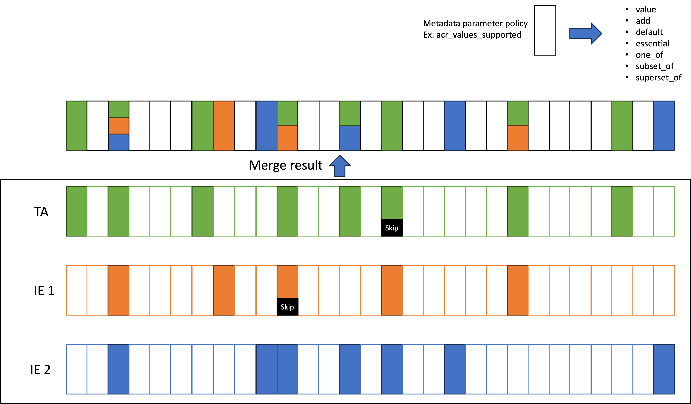

# The Swedish OpenID Federation - Challenges and Requirements

### 2023-12-11

## Abstract

This document addresses challenges when applying the OpenID federation draft standard
[https://openid.net/specs/openid-federation-1_0.html](https://openid.net/specs/openid-federation-1_0.html)
to a Swedish profile for OpenID federation based on the [introduction document](swedish-oid-fed-introduction.md).
A number of requirements for the [Swedish OpenID Federation Profile](swedish-oidc-fed-profile.md) are specified as the means to meet these challenges.

## 1. General concepts

This section outlines some general concepts used in the proposed requirements for the Swedish profile.

### 1.1. Extended chain validation

This document introduces an extended chain validation process that extends the chain validation process defined in the base standard. 
This extended chain validation process brings some vital enhancements to the federation infrastructures by:

- Allowing Trust Anchors to enforce critical policies when extending trust to federation services in other federations.
- Allowing federation services the choice to not publish Entity Configuration at their service.

The Definition of such extended chain validation can be done in a way that would prevent any party implementing the standard, 
but not implementing this extended functionality, 
from validating the same chain with a different validated result.

This gives all federation services a choice between:

1. participating in the federation using a simplified approach, where only peers compliant with this profile can validate their data, or;
2. adopting a more complex approach where their data can be validated by anyone.

Since all Resolvers in this profile will be required to implement this extended validation process (supporting the simplified enrollment), 
it should be a viable option for at least many RP:s to use the simplified enrollment strategy.

Details of how extended chain validation works are outlined in the profile.

## 2. Challenges and resolutions

### 2.1 Complexity for federation services

The current standard if fully implemented imposes a complex barrier of entry for federation services that want to participate in this federation ifrastructure.
This barrier of complexity is created by;

- the relatively complex process to gather and validate trusted data about other federation services.
- the requirement to publish a self-signed Entity Configuration statement at a specific location under their Entity Identifier URL.

The first issue can be mitigated quite easily by ensuring that all federation entities have access to a Resolver that can handle this task for them.

The second issue is more complex and requires the extended chain validation process as an amendment to the standard.

**Using extended chain validation to simplify enrollment**

A chain that supports basic standard chain validation could look like this:

- TA self-signed Entity Configuration (Directly trusted)
- TA Entity Statement for IE 1
- IE 1 Entity Statement for IE 2
- IE 2 Entity Statement for Federation service A
- Federation service A self-signed Entity Configuration

However, if we extend the capability of the standard, a chain that provides the same result could also look like this:

- TA self-signed Entity Configuration (Directly trusted)
- TA Entity Statement for IE 1
- IE 1 Entity Statement for IE 2
- IE 2 Entity Statement for Federation service A

This is possible IF:

1. "IE 2 Entity Statement for Federation service A" contains the full metadata of Federation service A
2. All relevant Resolvers are capable of resolving metadata for Federation Service A by traversing the federation top-down instead for from bottom up.
3. All relevant federation services interacting with Federation service A are using such Resolvers.

Resolvers can achieve point 2 as all Intermediate Entities are required to provide a "List" endpoint and a "Fetch" endpoint.
The Resolver then uses the "List" endpoint to obtain a list of all subordinate entities,
and the "Fetch" endpoint to obtain an Entity Statement for each subordinate entity.
The resolver can use these endpoints to traverse the whole federation for services that chains to any Trust Anchor without having to get
a single Entity Configuration if point 1 is satisfied.

When a federation service chooses this option to not publish an Entity Configuration,
it will not be discoverable by those entities that do not use Resolvers, 
but instead do chain construction bottom up, as described in the standard.
This bottom-up approach starts with obtaining the Entity Configuration from a ./well-known location bound to the Entity Identifier.

This provides a choice for each federation service whether they choose to opt for the simpler or the more complex approach, 
which will affect their visibility for services not using Resolvers. 
In case of the likely event, that all relevant services will use Resolvers, 
the simpler approach is likely a viable option, in particular for Relying Party services.

#### 2.1.1. Requirements for the Swedish profile

##### 2.1.1.1. Amendments to OpenID federation

The standard must be amended to support chain validation that does not end with an Entity Configuration issued by the target entity.
The Entity Configuration statement must be amended to provide information that this Entity Configuration issued to the target entity,
is the end of the chain and contains full information about the target entity.

This is achieved by defining a new Entity Statement claim that must be marked as critical in the "crit" claim. 
This new Entity Statement claim shall contain at least the following information:

- If the target entity has published an Entity Configuration at the location defined by the OpenID federation standard.
- If this Entity Statement contains complete metadata for the target entity.

**Note:**
It has been noted that an alternative that could be offed by Intermediate Entities, 
is to host Entity Configurations for federation services. 
This could allow a federation service to be discoverable also by entities not using compliant Resolvers, but has the following drawbacks:

- The federation service must be given an Entity Identifier based on the Intermediate Entity URL domain.
- The federation service must still sign this Entity Configuration with its federation key.

Offering and using such alternatives are outside the scope of the Swedish profile.

##### 2.1.1.2. Requirements to ensure availability of Resolvers

The Swedish profile should contain the following requirements: 

- At least every federation node acting as a TA MUST ensure the availability of at least one Resolver that can resolve federation data to that TA
- The federation resolver of a TA MUST be either the TA itself or a registered entity directly under the TA

### 2.2. Policy processing in multi federation setups

The limitations of the policy merge process have sparked a major discussion with the editors.

There is a collective agreement that the current merge algorithm is well-designed and useful in a single federation.
It does a great job to ensure that subordinate entities provide a policy that is kept within the limitations of any superior entity they chain to.

The problems with this are all related to multi-federation setups where many federations need to:

- Enforce local policy rules independent of each other.
- Allow services that meet the requirement of another federation to participate in that federation without having to enroll in that federation separately.

#### 2.2.1. Example of challenges - Requirements on client authentication methods

In this example a local federation has OIDC RP:s that only support `client_secret_post` while others support `private_key_jwt` as
token endpoint authentication method.
Some services in this federation need to access services in a national eID federation where there is a requirement to use
only `private_key_jwt`.

The requirements imposed by both federations are realistic and reasonable for their local context.

To enforce these rules,
the local federation provides a policy for `token_endpoint_auth_methods_supported` with the policy operator `superset_of` set to
{`client_secret_post`, `private_key_jwt`}.
This enforces all OP:s in this federation to support both `client_secret_post` and `private_key_jwt` in order to support their
RP:s that can only do client secret.
They opt to not use `subset_of` as they don't want to restrict other authentication methods,
just to enforce that these two are supported.

The national eID federation provides a policy for the same metadata parameter but with the intention to restrict values to only
`private_key_jwt`.
The TA can enforce this policy by setting the policy operator `subset_of` to the value `private_key_jwt` in combination with setting
the policy operator `essential` to true.
This will filter out any options supported by any OP other than the value `private_key_jwt` and ensures that the policy check will fail if
no value is present.
This means that only OP:s that support `private_key_jwt` will be accepted.

The problem is however that when the policy of the eID federation is merged with the policy of the local federation,
it will produce a merged policy that has both `superset_of` set to {`client_secret_post`, `private_key_jwt`} and `subset_of` set to the
value `private_key_jwt`.
This is an illegal combination and policy merge will fail since `subset_of` must be a superset of `superset_of`.
That is, the mandated minimum value set declared by `superset_of` must all be members of the maximum set declared by `subset_of`

In conclusion, there is no way that both federations can enforce the policy they deem to be relevant and still allow an OP of the local
federation to deliver its services to both federations.
This even if the OP can meet the requirements of both federations.

#### 2.2.2. Proposal to allow chain validation to skip subordinate policies in the merge process

The OpenID federation standard allows the definition of new policy operators
that can be declared critical by the `metadata_policy_crit` claim in Entity Statements.

The proposal is to define the new `skip_subordinates` metadata policy operator.
This operator, if set to true,
instructs the merge process to skip all subordinate metadata policies for this metadata parameter in the merge process.

Metadata policy merge policy using `skip_subordinates` is shown in the following illustration:

The `skip_subordinates` policy operator is indicated in the illustration by a black box labeled `Skip`.
The Illustration shows how all metadata parameter policies are merged normally, 
except for those metadata parameter policies that encounter the `skip_subordinates` policy operator.
When this policy operator is encountered,
any subordinate policy for that metadata parameter (such as `token_endpoint_auth_methods_supported`) is excluded from the merge process.

This allows an Entity Statement issued to another federation to enforce specific metadata parameter policy rules directly on the target
entity metadata, without facing the problem of merge errors.

The `skip_subordinates` metadata policy operator must be marked as critical to ensure that this chain can only be validated if the
validation software supports this mechanism.
This prevents different implementations from performing chain validation that produces different valid results.

#### 2.2.3. Requirements for the Swedish profile

The following actions and requirements should be included in the Swedish profile

- Define the `skip_subordinates` metadata policy operator (See Metadata policy expression below)
- Require that it must be marked critical in `metadata_policy_crit` claim in Entity Statements that include them.
- Recommend (or require) that this policy operator is only used in Entity Statements that bridge to other federations with incompatible policy requirements.
- Require that all Resolvers in the federation supports extended path validation with `skip_subordinates` metadata policy operators

### 2.3. Metadata policy expression

The OpenID federation draft standard defines the following policy operators:

| Operator    | Definition                                                                                       |
|-------------|--------------------------------------------------------------------------------------------------|
| value       | Sets a specific value, regardless of whether metadata already has this parameter present or not. |
| add         | Add this value if not already present.                                                           |
| default     | If no value is present (after processing value and add) set this default value.                  |
| essential   | Requires a value to be present.                                                                  |
| one_of      | The value must be exactly one of the listed values.                                              |
| subset_of   | Express a maximum value set. All metadata parameter values are restricted to this set.           |
| superset_of | Express a minimum value set. The metadata parameter must contain these values                    |

#### 2.3.1. Problem with value modifiers

These operators are of three types:
- value modifier: Has the capability to change the value to a value that is different from what was declared in the original metadata
- value restriction: Has the capability of restricting the value defined in original metadata to a subset of the originally declared options
- value checks: Test the original metadata for compliance, but makes no attempts to modify any metadata.

`value`, `add` and `default` are value modifiers, `subset_of` is a value restriction, and the rest are value checks.

The problem with value modifiers is that they can be dangerous if used inappropriately,
and that they introduce complexity for federation services.
- a value modifier may introduce a value that claims that the entity supports something that this entity actually does not support.
- The fact that policy can change metadata parameter values may require all federation services to assess what their resolved metadata is at each TA

Value modifiers are not necessary as there exist other ways to enforce metadata values.
When the superior entity (Intermediate or Trust Anchor) registers a federation service,
it has the option in its issued Entity Statement to set specific metadata values for the federation service.
This can be done individually for each registered federation service and in close cooperation with that service.
This should be a safer and more appropriate way to set specific metadata values than to do it by value modifiers in policy.

#### 2.3.2. Define new value checks

The standard allows the definition of custom policy operators.
This can become useful since the default policy operators are somewhat limited.
Below are two additional value checks that are discussed for inclusion in the standard:

**Intersects**

The current operators are not able to handle the requirement where the metadata parameter must contain at least one of a set of supported values,
without restricting what values that can be set.

An example of this is a requirment that OPs must support either "Loa 3" or "eIDAS substantial",
but they are allowed to support others as well (e.g. LoA 2).

There is a proposal for the OpenID federation draft standard to include a new operator `intersects` for this purpose.
The `intersects` operator holds a list of values.
This value check is satisfied if the metadata parameter includes at least one of the listed values.

**Regexp**

The current version of the draft standard includes the example of a policy operator `regexp`.
However, this operator is only included as an example of a custom operator and is not defined in the standard.
This value check could, however, be very useful to enforce parameter structure requirements.
One useful application could be to provide a "regexp" value check to enforce that metadata values holding a URL has the basic structure of a URL.

**Skip subordinates***

Define the `skip_subirdinates policy` operator as defined in section 2.2.3.

#### 2.3.3. Requirements for the Swedish profile

- State that value modifiers that add values not specified by the target entity SHOULD NOT be used
- Define the following custom policy operators (unless defined in the core standard):
    - `intersects`
    - `regexp`
    - `skip_subordinates`

### 2.4. Discovery support

The Resolver as specified by the OpenID federation draft standard only defines an API for resolving a specific EntityID to a specified TA.
There is also a request parameter to specify the entity type, but this will only limit the set of metadata returned for that entity in case
this entity serves multiple roles.

There is currently no defined API to request a list of resolvable entities of a specified type from the Resolver.
This is considered essential to allow services to build a list of selectable services in a discovery UI,
such as allowing an RP to show a list of available OPs.

#### 2.4.1. Requirements for the Swedish profile

Define a discovery endpoint for Resolvers that provides a list of resolvable entities (List of Entity Identifiers)

**Input parameters**

- `trust_achor` - EntityID of Trust Anchor
- `entity_types` - Identifier of the requested entity types
- `trust_marks` - List of Trust Mark identifiers that must be supported

**Output**

List of resolvable Entity Identifiers matching the request.

### 2.5. Complete metadata for each entity type

The current standard defines a generic set of metadata parameters that can be included in metadata for any entity type.
This metadata can be defined in the entity type "Federation Entity" which is an entity type that is used by federation nodes
that does not provide any federation service, but only provides federation roles such as TA, IE, Resolver or Trust Mark issuer.

There is currently an option to store the common metadata parameters in "Federation Entity" metadata also when the
entity is just a federation service, such as an OP or an RP. However, that has several negative consequences.

The major problem is that metadata for the entity gets divided between several entity types and that is not compatible with
the current Resolver API. If federation data is requested by a resolver and entity type is specified to OP, then only
OP metadata will be returned and not the common relevant metadata parameters stored under the "Federation Entity" type.

#### 2.5.1. Requirements for the Swedish profile

All metadata parameters that are relevant for a federation service MUST be provided in the metadata for the entity type of that service.

