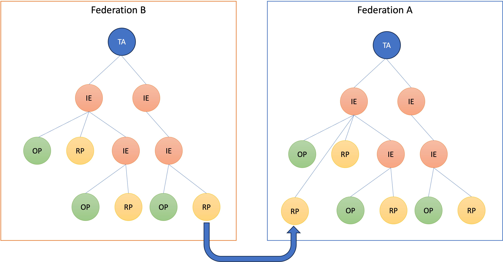
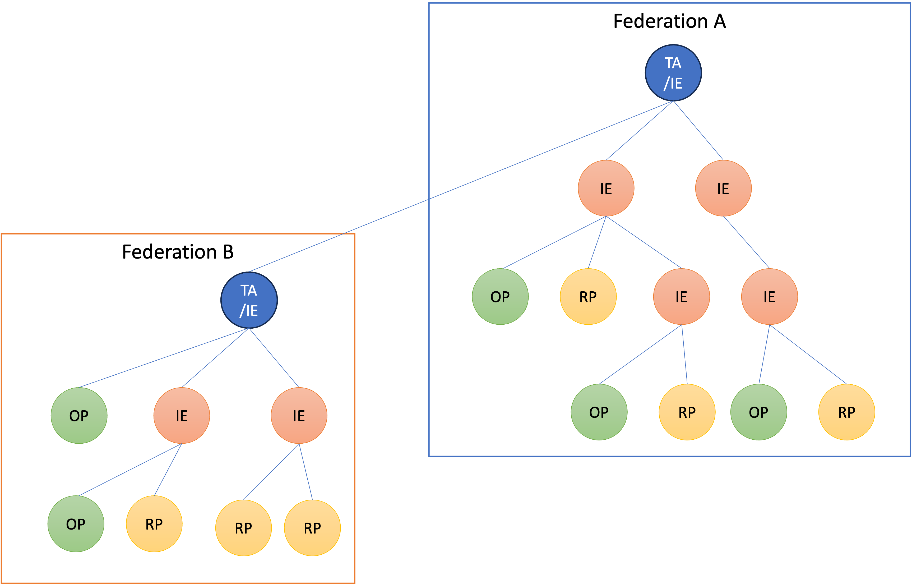

# The Swedish OpenID Federation - Introduction

### Version: 0.1 - 2023-12-11

## Abstract

This document describes in layperson terms how the OpenID federation draft standard
[[https://openid.net/specs/openid-federation-1_0.html](https://openid.net/specs/openid-federation-1_0.html)]
works and how it can be used to provide the architecture of collaborating Swedish OpenID Federations.

The purpose of this document is to provide an introduction to OpenID federation as a baseline for deeper understanding of challenges
and creation of a Swedish profile.

## Introduction

The OpenID federation draft standard defines a structure of interconnected federation entities that cooperate to share trusted information
about federation services. Federation services in this context are OpenID Connect services such as OpenID providers (OP) and OpenID
relying parties (RP), but also OAuth services such as Authorization Services (AS), OAuth clients (Client) and Resource Servers (RS).

The purpose of OpenID federation is to define an infrastructure for sharing authenticated and authorized data between federation
services to allow these services to interact without prior mutual configuration setup.
Contrary to SAML federations, this is not achieved by a central metadata service,
but rather by introducing a set of new federation roles to support authenticated and authorized configuration data exchange:

- Trust Anchor (TA)
- Intermediate Entity (IE)
- Trust Mark Issuer (TMI)
- Resolver

The federation services and federation entities providing these roles are organized in tree structures as illustrated the following figure:

**Trust Anchor**

The Trust Anchor (TA) serves as origin or trust for a collection of federation services. The purpose is to allow verification of
all data about entities under a TA using a single trusted TA key. This is equal to using a single trusted metadata provider key in
a SAML federation.

**Intermediate Entity**

The Intermediate Entity (IE) allows delegation of registration of subordinate federation services. This allows distributed
administration and enrollment of federation services that can be verified under a common TA.

**Trust Mark Issuer**

The Trust Mark Issuer (TMI) has been delegated the authority to issue Trust Marks for federation services. This Trust Mark is a signed
statement that a federation service meets certain defined requirements. This concept is further elaborated in this document.

**Resolver**

The Resolver provides a service for easy access to verified data about federation entities such as verified metadata and verified
Trust Marks. The resolver handles the discovery and verification process defined by the OpenID federation to locate, process
and verify data about federation entities in the context of a specified TA. The Resolver service is an entity under the TA which allows
verification of the resolved data from the resolver to be verified by the configured TA key.

## Definitions

The following terms are used in this document to enhance readability:

| Term                    | Meaning                                                                                                                                                                                                                                                                                                               |
|-------------------------|-----------------------------------------------------------------------------------------------------------------------------------------------------------------------------------------------------------------------------------------------------------------------------------------------------------------------|
| Federation service      | A defined OpenID Connect or OAuth service such as OpenID providers (OP). OpenID relying parties (RP), OAuth Authorization Services (AS), OAuth clients (Client) and Resource Servers (RS)                                                                                                                             |
| Federation node         | A Federation Entity that is not a Federation service, but serves as either Trust Anchor, Intermediate Entity, Trust Mark Issuer or Resolver                                                                                                                                                                           |
| Federation service data | The data of a federation service that includes metadata and Trust Marks, but also information such as policy. Federation service data is provided as an Entity Statement issued by a Federation Node for a subordinate entity or as Entity Configuration provided as a self signed statement by any federation entity |

In addition to these terms, all terms defined by the OpenID federation draft standard apply.

# Federation Architecture

### Chain validation

The core for discovery and verification of federation service data, to support service exchange between federation services,
is based on the OpenID federation chain validation process.

Chain validation is a process through which federation service data is located and validated through a trusted TA.
This involves the following steps:

- Locate the Entity Configuration (Self-signed Federation service data) of the federation service target entity
- Build the chain by finding the sequence of Intermediate Entities that can be used to construct a path to the trusted TA.
- Obtain Entity Statements from each federation node issued for the subordinate entity in the chain from the TA down to the target entity.
- Validate all Entity Statements and the target entity's Entity Configuration in the chain via the TA trusted key
- Process metadata policy of the chain to obtain the validated and approved metadata in the context of the selected TA.
- Extract all relevant trust Marks from the target entity's Entity Configuration
- Find All Trust Mark Issuers that have issued relevant Trust Marks and perform this chain validation on each Trust Mark Issuer to evaluate their authorization to issue the Trust Mark and to get their validation key.
- Verify all relevant Trust Marks
- Check the revocation status of each relevant Trust Mark

### The split between metadata and Trust Marks

In SAML federation metadata, all the metadata is signed by the federation operator using the federation metadata service.
This metadata contains both pure configuration data such as service URL:s but also information about authorizations such as the capability
to provide a certain level of assurance.
This increases the burden on the federation operator when enrolling services as this process needs to cover both registration of configuration
data and validation of certifications and authorizations that are relevant for their roles.

The OpenID federation elegantly enhances this situation by separating configuration data from validation of certifications and authorizations.
Configuration data is expressed as metadata, while fulfillment of requirements, certifications and authorizations is handled by Trust Marks,
issued by authorized Trust Mark Issuers.
This allows the federation operator to focus on management of configuration data which much more easily can be delegated
to administrative Intermediate Entities.
This also allows the federation operator to manage a large federation with a minimum of administrative resources.

### Resolves

While the introduction of Intermediate Entities and Trust Mark Issuers makes the federation much easier to manage,
it also makes discovery and validation of federation service data significantly harder compared with SAML metadata handling.
While SAML metadata is quite straightforward to download and validate,
OpenID Federation service data must be discovered and validated through the quite complex chain validation process described above.

To enhance the situation for federation services that do not have the ambition and desire to implement full chain validation,
OpenID federation has defined the Resolver role to allow easy access to validated federation service data.
The Resolver offers a simple API where a federation service can request validated Federation service data about another federation service
using a simple HTTP GET request to a resolve endpoint.
Any federation node can provide such a resolve endpoint, but it can also be the sole dedicated role of a federation node.

The resolve request to a resolve endpoint includes the target Entity Identifier and the Trust Anchor that should be used and may also
specify the requested entity type.
The Resolver responds with a signed statement that contains validated metadata processed through metadata policies of the chain
and validated Trust Marks.

### Entity Configuration, Entity Statements and discovery

Entities in the federation are interconnected through Entity Statements.
An Entity Statement is a signed statement provided by a superior entity for a subordinate entity in a chain.
This structure of superior and subordinate entities interconnected by Entity Statements makes up the tree structure of federation entities.
The Entity Statement asserts the authorized properties of the subordinate entity including its metadata,
federation key and authorization to provide specified roles.
Each entity in the federation is also required to provide a statement about itself.
This is defined as the Entity Configuration of the entity.

All chain validations of federation service data start with an Entity Configuration found at a location that can be derived from the
Entity Identifier of that federation service.
A fundamental requirement for successful discovery and chain validation of entity data in OpenID federation
is therefore that all entities publish a self-issued Entity Configuration document.
This document serves as a self-declaration of this entity's capabilities and authorizations through metadata and Trust Marks.
This Entity Configuration also includes information about superior entities, which is used to build a chain to the target TA.

This Entity Statement must be located at a URL that can be derived from the EntityIdentifier of the target entity using a /.well-known location
URL path extension.
This requires that all services must have an Entity Identifier based on a domain name under their control,
and requires that the federation services have the capability to publish an Entity Configuration document at a /.well-known location URL.

Arguably, not all federation services may have the capability to meet this requirement.
It may be important, in such cases, to be able to enroll federation services that do not have the capability to create and/or publish
a self-signed Entity Configuration this way.
This can be solved by delegating the creation and publication of EntityStatements to the superior Intermediate Entity.
Such an Intermediate Entity can provide a suitable Entity Identifier derived from the domain name of that Intermediate Entity.
This allows the Intermediate Entity to publish the Entity Configuration on behalf of the subject federation service.
This procedure solves the publication problem,
but still requires the Entity Configuration to be signed with the entity key of the federation service.
This challenge still has to be managed between the enrolling federation service and the Intermediate Entity handling the enrollment.
This manner through which this process is handled is outside the scope of the present standard,
but there are ongoing discussions on allowing also delegated signing of Entity Configuration data.

### Metadata Policy

Each Entity Configuration published by all Federation Entities (federation services and federation nodes) contains metadata that
reflects the capabilities and preferences of that entity. This metadata can be modified or rejected in the chain validation process.

Each federation node (TA and IE) can express a metadata policy in each Entity Statement they provide.
That metadata policy expresses rules for acceptance and modification of metadata for the subject of that Entity Statement and for all superior
entities validated through the subject entity.

The current version of the OpenID federation draft standard specifies a mandatory processing algorithm,
where all policies of the path are merged to a single policy.
This merge algorithm is currently under discussion as it requires close collaboration of federation nodes to define policies
that do not create merge conflicts or alter intended policy settings by TAs.

The intention of this policy processing is both to allow the federation service to express all its capabilities and requirements using self-issued statements,
but at the same time define rules within the context of each TA that can enforce constraints on that metadata.
Because the policy enforces metadata automatically through chain validation,
the enrollment of federation services can therefore be done without extensive checks on metadata content.
This allows for a more simplified delegated enrollment process based on self-issued statements.

## Multi federation participation

Federation service may need to participate in multiple federations. One rather common way to handle this for the federation service
to enroll independently in these federations

In this illustration, the Relying Party service participates in two federations by independently enrolling to both of them.
This is a problem, however, if this RP has opted to not create and publish its own Entity Configuration,
but rather has opted for delegating this to its superior Intermediate entity.
In this case, the federation service has been assigned an Entity Identifier based on the Intermediate Entity domain name.
When this federation service enrolls in another federation,
it may have to change its Entity Identifier if the enrollment requires any modifications to its Entity Configuration.

The metadata policy processing of OpenID federation opens the door to another possibility by connecting these two federations.
This connection is done by issuing an Entity Statement from one federation to another which allows services in the
subordinate federation B to participate in federation A that issued the Entity Statement.

All services in federatioin B can now participate in federation A as long as the policy applied by TA in federation A can be defined in
such way that metadata of services in federation B conforms to the requirements of federation A.

## Application of OpenID federation in Sweden

The situation in Sweden is that we currently today have several independent federations where several federation services have a
legitimate need to participate in several federations.

Examples of such federations are:

- National eID federation for authentication of citizens using national eID
- Federation for medical services
- Federations for educational purposes
- Federation for authorization across governmental services

Federation services in these federations include private and public entities and a range of trust and security levels.

Some examples of a service that needs to participate in multiple federations are:

- Service provider in the medical sector needs the capability to authenticate medical profession users using OP in the local federation, but also needs to authenticate patients using OP:s in the national eID federation.
- OP in the health care federation joins the national eID federation as OP for authenticating medical personnel in governmental services in the national eID federation.
- Client in the authorization federation also has a need to become an RP in the national eID federation.

The purpose of a national OpenID federation profile should be to define additional requirements to OpenID federation in order to:

- Ensure the availability of critical functions and services to provide a low threshold for participation
- Promote interoperability among implementations and use of common integration tools
- Allow successful interconnection of federations to lower administrative overhead

