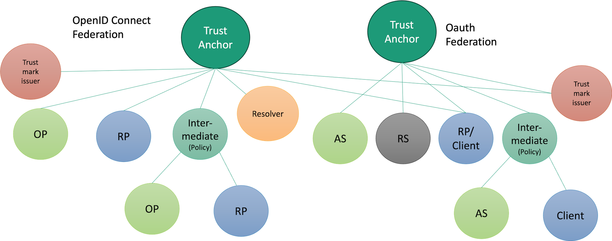
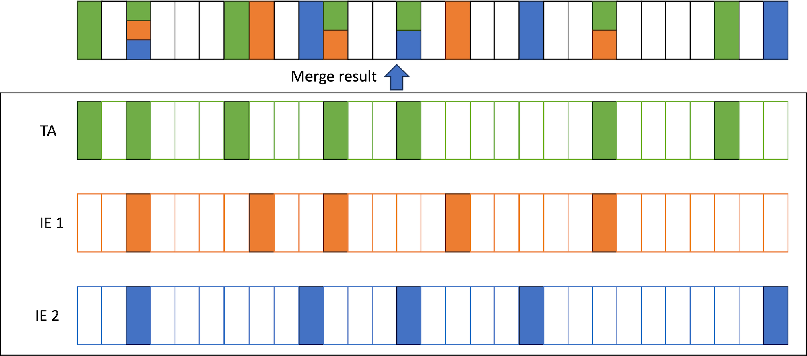

# The Swedish OpenID Federation - Introduction

### 2024-03-07

## Abstract

This document describes in layperson terms how the OpenID federation draft standard
[https://openid.net/specs/openid-federation-1_0.html](https://openid.net/specs/openid-federation-1_0.html)
works and how it can be used to provide the architecture of collaborating Swedish OpenID Federations.

The purpose of this document is to provide an introduction to OpenID federation as a baseline for deeper understanding of challenges
and creation of a Swedish profile.

## Introduction

The OpenID federation draft standard defines a structure of interconnected federation entities that cooperate to share trusted information
about federation services. Federation services in this context are OpenID Connect services such as OpenID providers (OP) and OpenID
relying parties (RP), but also OAuth services such as Authorization Services (AS), OAuth clients (Client) and Resource Servers (RS).

The purpose of OpenID federation is to define an infrastructure for sharing authenticated and authorized data between federation
services to allow these services to interact without prior mutual configuration setup.
Contrary to SAML federations, this is not achieved by a central metadata service,
but rather by introducing a set of new federation roles to support authenticated and authorized configuration data exchange:

- Trust Anchor (TA)
- Intermediate Entity (IE)
- Trust Mark Issuer (TMI)
- Resolver

The federation services and federation entities providing these roles are organized in tree structures as illustrated the following figure:

**Trust Anchor**

The Trust Anchor (TA) serves as origin or trust for a collection of federation services. The purpose is to allow verification of
all data about entities under a TA using a single trusted TA key. This is equal to using a single trusted metadata provider key in
a SAML federation.

**Intermediate Entity**

The Intermediate Entity (IE) allows delegated registration of subordinate federation services. This allows distributed
administration and enrollment of federation services that can be verified under a common TA.

**Trust Mark Issuer**

The Trust Mark Issuer (TMI) has been delegated the authority to issue Trust Marks for federation services. This Trust Mark is a signed
statement that a federation service meets certain defined requirements. This concept is further elaborated in this document.

**Resolver**

The Resolver provides a service for easy access to verified data about federation entities such as verified metadata and verified
Trust Marks. The resolver handles the discovery and verification process defined by the OpenID federation to locate, process
and verify data about federation entities in the context of a specified TA. The Resolver service is an entity under the TA which allows
verification of the resolved data from the resolver to be verified by the configured TA key.

## Definitions

The following terms are used in this document to enhance readability:

| Term                           | Meaning                                                                                                                                                                                                 |
|--------------------------------|---------------------------------------------------------------------------------------------------------------------------------------------------------------------------------------------------------|
| Federation service             | A defined OpenID Connect or OAuth service such as OpenID providers (OP). OpenID relying parties (RP), OAuth Authorization Services (AS), OAuth clients (Client) and Resource Servers (RS)               |
| Federation node                | A Federation Entity that is not a Federation service, but serves as either Trust Anchor, Intermediate Entity, Trust Mark Issuer or Resolver                                                             |
| Federation service information | Information about a federation service that are distributed and authenticated using this federation infrastructure. Federation service information includes verified metadata and verified trust marks. |

In addition to these terms, all terms defined by the OpenID federation draft standard apply.

# Federation Architecture

### Locating and validating trusted entity information

The core purpose of the OpenID federation infrastructure is
to allow services to locate and validate federation service information about other entities with whom they intend to interact.

This is built around two main processes: 

- **Discovery** 
- **Chain validation**

The **discovery process** involves identification and location of information resources
that can be used to construct a trusted chain of statements from a target entity to a trusted TA.
It is important to note that discovery can be done using both top-down and bottom-up strategies.

The **bottom-up** strategy (the main strategy for federation services) starts with locating the claimed metadata of the target entity.
This data is used to locate superior entities until a trusted Trust Anchor service is reached.

The **top-down** strategy is much more resource consuming,
but it may be suitable for entities that which to build a complete map of all available services in a local cache.
This strategy starts from a trusted Trust Anchor
and traverses the full tree of services down to all leaf entities supported by each Trust Anchor.

**Chain validation** is a process through which a chain of statements is validated through the trusted TA keys and policies.

A typical bottom-up discovery with chain validation typically involves the following steps:

1. Locate the Entity Configuration (Self-signed federation service information) of the federation service target entity
2. Build the chain by finding the sequence of Intermediate Entities that can be used to construct a path to the trusted TA.
3. Obtain Entity Statements from each federation node issued for the subordinate entity in the chain from the TA down to the target entity.
4. Validate all Entity Statements and the target entity's Entity Configuration in the chain via the TA trusted key
5. Process metadata policy of the chain to obtain the validated and approved metadata in the context of the selected TA.
6. Extract all relevant trust Marks from the target entity's Entity Configuration
7. Find All Trust Mark Issuers that have issued relevant Trust Marks and perform this chain validation on each Trust Mark Issuer to evaluate their authorization to issue the Trust Mark and to get their validation key.
8. Verify all relevant Trust Marks
9. Check the revocation status of each relevant Trust Mark

### Dividing federation entity information into metadata and Trust Marks

In SAML federation metadata, all the metadata is signed by the federation operator using the federation metadata service.
This metadata contains both pure configuration data such as service URL:s but also information about authorizations such as certification
that the authentication process of an OP meets a certain level of assurance.
This increases the burden on the federation operator when enrolling services as this process needs to cover both registration of configuration
data and validation of certifications and authorizations that are relevant for their roles.

The OpenID federation elegantly improves this situation by separating configuration data from validation of certifications and authorizations.
Configuration data is expressed as metadata, while fulfillment of requirements, certifications and authorizations is handled by Trust Marks,
issued by authorized Trust Mark Issuers.
This allows the federation operator to focus on management of configuration data which much more easily can be delegated
to administrative Intermediate Entities.
This also allows the federation operator to manage a large federation with a minimum of administrative resources.

### Resolvers

While the introduction of Intermediate Entities and Trust Mark Issuers makes the federation much easier to manage,
it also makes discovery and validation of federation service information significantly harder compared with SAML metadata handling.
While SAML metadata is quite straightforward to download and validate,
OpenID federation service information must be discovered and validated through the quite complex chain validation process described above.

To enhance the situation for federation services that do not have the ambition and desire to implement full chain validation,
OpenID federation has defined the Resolver role to allow easy access to validated federation service information.
The Resolver offers a simple API where a federation service can request validated federation service information about another federation service
using a simple HTTP GET request to a resolve endpoint.
Any federation node can provide such a resolve endpoint, but it can also be the sole dedicated role of a federation node.

The resolve request to a resolve endpoint includes the target Entity Identifier and the Trust Anchor that should be used and may also
specify the requested entity type.
The Resolver responds with a signed statement that contains validated metadata processed through metadata policies of the chain
and validated Trust Marks.

### Entity Configuration, Entity Statements and discovery

Entities in the federation are interconnected through Entity Statements.
An Entity Statement is a signed statement provided by a superior entity for a subordinate entity in a chain.
This structure of superior and subordinate entities interconnected by Entity Statements makes up the tree structure of federation entities.
The Entity Statement asserts the authorized properties of the subordinate entity including its metadata,
federation key and authorization to provide specified roles.
Each entity in the federation is also required to provide a statement about itself.
This is defined as the Entity Configuration of the entity.

All chain validations of federation service information start with an Entity Configuration found at a location that can be derived from the
Entity Identifier of that federation service.
A fundamental requirement for successful discovery and chain validation of entity data in OpenID federation
is, therefore, that all entities publish a self-issued Entity Configuration document.
This document serves as a self-declaration of this entity's capabilities and authorizations through metadata and Trust Marks.
This Entity Configuration also includes information about superior entities, which is used to build a chain to the target TA.

This Entity Statement must be located at a URL that can be derived from the EntityIdentifier of the target entity using a /.well-known location
URL path extension.
This requires that all services must have an Entity Identifier based on a domain name under their control,
and requires that the federation services have the capability to publish an Entity Configuration document at a /.well-known location URL.

Arguably, not all federation services may have the capability to meet this requirement.
It may be important, in such cases, to be able to enroll federation services that do not have the capability to create and/or publish
a self-signed Entity Configuration this way.

This can be solved by delegating the creation and publication of Entity Configurations to the registration Intermediate Entity.
To do so, the registration Intermediate Entity must:

- Provide a suitable Entity Identifier derived from the domain name of the Intermediate Entity.
- Hold the federation key representing the registered entity.

**Note:** the federation key in this case is NOT the key used by the entity when operating its service (I.e. the key used to sign requests to an OP).
The "Federation key" is the key used by this entity to sign data in OpenID federation such as Entity Configuration data.

### Metadata Policy

Each Entity Configuration published by all Federation Entities (federation services and federation nodes) contains metadata that
reflects the capabilities and preferences of that entity. This metadata can be modified or rejected in the chain validation process.

Each federation node (TA and IE) can express a metadata policy in each Entity Statement they provide.
That metadata policy expresses rules for acceptance and modification of metadata for the subject of that Entity Statement and for all superior
entities validated through the subject entity.

### Policy processing in chain validation

The OpenID federation draft standard specifies a mandatory policy processing algorithm,
where all policies of the path are merged to a single policy before being applied to the metadata of the target entity.

The intention of this policy processing is to:

1. Determine if the target entity can be validated through a TA (meet minimum policy requirements)
2. Limit or alter capabilities expressed in the target entity metadata so that it complies with the policies of the validated chain.

The merge algorithm is designed to guarantee that the metadata of the target entity is compliant with all policies in a chain.
To achieve this, the merge algorithm will produce one of the following results:

- a merged policy that is compliant with all metadata policies in the path or;
- return a merge error, failing validation of the target entity metadata.

Some mechanisms used to achieve this result are:

| Policy                           | Merge rule                                                                                                                |
|----------------------------------|---------------------------------------------------------------------------------------------------------------------------|
| A maximum set of allowed values  | The merged set is the intersection of all maximum sets, ensuring that the metadata value does not extend any maximum set. |
| A minimum set of required values | The merged set is the union lf all minimum sets, ensuring that the metadata supports all minimum sets.                    |
| A specific value is required     | The merge process fails if not all policies agrees on the same required value.                                            |

The strength of this approach is that this ensures that all policies of the path will be honored. 
The challenge with this approach is that this requires very strong harmonization of metadata policy expression to avoid merge conflicts.

A merge conflict is created when it becomes impossible to meet both policies at the same time.
Example: if one policy requires that options A and B must be supported (minimum set), 
while another policy requires that only A and C are allowed (maximum set).

Metadata policy rules are managed and merged per metadata parameter as shown in the following illustration:

A metadata policy consists of a list of metadata parameter policies. E.g. the policy parameter `acr_values_supported` can have one
metadata parameter policy and `response_types_supported` can have another policy. Each metadata parameter policy consists of one or
more policy operators further elaborated in the section "Metadata policy expression" below.

The merge algorithm merges all individual policy operators of each metadata parameter policy into a merged metadata parameter policy.
The result of such merge policy can lead to the following results:

- The new merged policy is a legal combination of the merged policies
- Merge error caused by conflicting policy operators

The result, if successful, is a new policy that is compliant with all individual merged policies. 
If not successful, the result is a merge error.

## Multi federation participation

Federation service may need to participate in multiple federations. One rather common way to handle this for the federation service
to enroll independently in these federations

In this illustration, the Relying Party service participates in two federations by independently enrolling to both of them.
This is, however, quite ineffective if the goal is, for example, 
to allow all RP:s in a federation to access the OP:s of another federation.
This could be the case if we want to allow all RP:s in a health care federation the opportunity
to use OP:s in a national eID federation.

The metadata policy processing of OpenID federation opens the door to another possibility by connecting these two federations.
This connection is done by issuing an Entity Statement from one federation to another which allows services in the
subordinate federation B to participate in federation A that issued the Entity Statement.

All services in federation B can now participate in federation A,
as long as metadata policies in all new cross-federation chains do not create merge conflicts.

The challenge here is if the policies that govern interaction within the context of one federation
are created in a way that can't be merged with the policies of the other federation.
This could be the situation, for example, 
if federation B applies a local policy that requires support for a set of scopes that are not allowed in the context of federation A,
or a similar situation.

This limitation is addressed in the challenges document.

## Application of OpenID federation in Sweden

The situation in Sweden is that we currently today have several independent federations where several federation services have a
legitimate need to participate in several federations.

Examples of such federations are:

- National eID federation for authentication of citizens using national eID
- Federation for medical services
- Federations for educational purposes
- Federation for authorization across governmental services

Federation services in these federations include private and public entities and a range of trust and security levels.

Some examples of a service that needs to participate in multiple federations are:

- Service provider in the medical sector needs the capability to authenticate medical profession users using OP in the local federation, but also needs to authenticate patients using OP:s in the national eID federation.
- OP in the health care federation joins the national eID federation as OP for authenticating medical personnel in governmental services in the national eID federation.
- Client in the authorization federation also has a need to become an RP in the national eID federation.

The purpose of a national OpenID federation profile should be to define additional requirements to OpenID federation to:

- Ensure the availability of critical functions and services to provide a low threshold for participation
- Promote interoperability among implementations and use of common integration tools
- Allow successful interconnection of federations to lower administrative overhead

